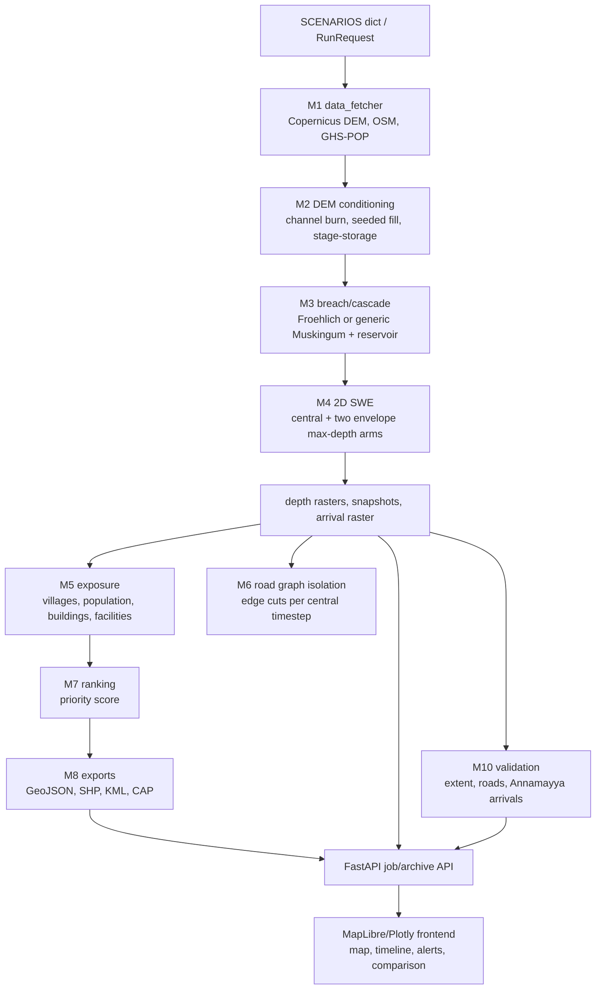

# FloodSight Deep Repository Review

**Review date:** 2026-09-11  
**Repository:** `D:\sih_work\floodsight`  
**Specification:** `C:\Users\chaud\Downloads\FloodSight_Deep_Review_Prompt.md`  
**Mode:** review only. No production source files were changed for this review.

The attached prompt is the review specification. Its instructions were treated as requirements for the audit, while the user request was the authorization to inspect the repository and write this report. The report distinguishes observed evidence in this checkout from inference and proposed design.

## A. Executive summary

FloodSight has a credible numerical core for a narrow class of idealized tests: the from-scratch finite-volume shallow-water solver is well-balanced, has a positivity treatment, tracks injected/stored/outflow/clipped volume, and the existing benchmark tests pass. The repository also contains useful geospatial ingestion, exposure, road-isolation, output, and validation modules.

The end-to-end product is not yet a technically defensible historical dam-break or compound-event platform. The primary risks are upstream of the map:

- **P0 physical/data correctness:** SAR fallback can return Annamayya observation geometry for an arbitrary scenario; backend hydraulic coordinates and frontend geometry have independent sources of truth; cascade pre-breach and post-breach reservoir states are discontinuous; post-breach 2D water is injected at a point kernel rather than through a verified breach body and connected storage.
- **P1 historical credibility:** most SIH-listed Indian events are absent; observations are concentrated in four scenarios and often precomputed/local without raw source artifacts; the model compares only a maximum-depth extent in the normal path; only the central ensemble arm drives exposure and isolation; and the ranking uncertainty band is a fixed score multiplier.
- **P1 geospatial/data quality:** every configured breach point is inside its DEM, but terrain samples expose a vertical/location mismatch in Derna and only about 3 m freeboard at South Lhonak. Annamayya keeps the configured point as the solver/map breach while a different centerline point is the stated audit target. No automated check proves dam, river, upstream storage, and downstream channel connectivity.
- **P1 API/operational safety:** the API accepts unvalidated scenario and numeric parameters plus arbitrary local file paths, runs blocking simulations through FastAPI `BackgroundTasks`, and reconstructs saved jobs from directory names/coordinate heuristics without a manifest or input hash.
- **P2/P3 product architecture:** scenario metadata, event clocks, shelters, dam geometry, outflow paths, and historical event descriptions are duplicated or hardcoded in the frontend. The map loads every frame and prefetches every raster, while road timelines can contain 10,591 features.
- **P4 maintainability:** stale documents, dead solver wrappers, old diagnostics with hardcoded UUIDs, demo paths, generated artifacts, and an untracked test/module pair obscure the authoritative execution path.

The strongest positive finding is that the repository already has enough working pieces to support a repair, but they need a canonical scenario/event schema, a single geospatial source of truth, an explicit event graph/time model, and validation gates before visual polish or operational alerts are trusted.

### Evidence boundaries

Observed during this audit:

- `SCENARIOS` contains seven keys: `phutkal`, `rishiganga`, `derna`, `malpasset`, `ivanovo`, `south_lhonak`, and `annamayya`.
- The current DEMs are projected UTM GeoTIFFs and all configured breach points fall within their raster bounds.
- `pytest -q` fails during collection on the untracked `tests/test_annamayya_cascade_arrivals.py`; excluding that file gives `69 passed, 25 warnings`.
- The current checkout had 14 modified tracked files and two untracked files before the report was created. Those changes were treated as the code under review and were not reset.
- The artifact scan found 125 scenario directories, 106 containing `results.geojson`, approximately 7,481 files/440 MB under `data/scenarios`, approximately 951 files/900 MB under `data/validation`, and approximately 939 MB under `data/population`.

Inferred or not independently established:

- Historical coordinates and event values are not re-certified against external authorities here. Repository evidence is classified as observed, reconstruction, assumption, precomputed, proxy, or unknown exactly where the code exposes it; undocumented values remain **UNKNOWN**.
- Browser FPS, heap, and request timings were not collected from a running browser session. Performance findings below are derived from code paths and artifact sizes; the roadmap includes the required instrumentation.

## B. Current architecture



### Actual execution path

`run_pipeline.execute_full_simulation` (`run_pipeline.py:180`) loads a scenario, fetches or reuses a DEM, reprojects WGS84 coordinates to the DEM CRS, conditionally snaps non-explicit points, builds a stage-storage estimate, creates either a routed breach ensemble or a generic cascade, runs three 2D arms, writes central snapshots and rasters, computes exposure/isolation/ranking, exports outputs, and invokes M10 when an observed source is registered. `src/api/main.py` wraps this call in an in-memory job record and exposes files and JSON to the frontend.

The path is less general than the module names imply. The hydraulic source is a single Gaussian 5x5 cell injection (`src/m4_solvers/swe_2d.py`), cascade state is configured per scenario, the side arms stop at maximum-depth envelope generation, and the frontend overlays its own structure and event geometry.

### Source-of-truth map

| Domain | Current source(s) | Review result |
|---|---|---|
| Scenario identity/parameters | `src/data_fetcher.py:58-474`, API request, frontend `SCENARIO_DAMS` | Duplicated; no schema/version/hash |
| Breach coordinate | `SCENARIOS.breach_lon/lat`, optional `breach_centerline_utm`, river snapping | Projection is mostly correct, but source point/centerline semantics differ |
| Dam/reservoir geometry | frontend `SCENARIO_DAMS` and `_buildDamGeoJSON` | Hand-drawn client geometry, not solver-derived |
| Event clock | `event_origin_ist` only for Annamayya; frontend event clocks/spine literals | Mixed backend simulation time and frontend historical time |
| Observed flood | `src/m10_validation/observed.py`, local GeoJSON | Four scenario entries; raw provenance incomplete for some |
| SAR | cached `data/satellite/*.geojson`, GEE fallback | Cached dates are identical; fallback is cross-scenario |
| Run selection | `_rehydrate_saved_scenarios`, latest mtime | Deterministic ordering but no validity manifest |

## C. Full bug register

Severity uses the requested P0–P4 roadmap scale. Category is the type of defect.

| ID | Severity | Area/category | File and location | Problem and root cause | Evidence | Proposed fix |
|---|---|---|---|---|---|---|
| FS-001 | P0 | Data/validation | `src/gee_satellite.py:90-108` | Local SAR fallback ignores the requested bbox/scenario and returns the first existing candidate, beginning with Annamayya. | Direct call with a Derna bbox returned Annamayya coordinates/properties. | Key fallback by scenario and acquisition metadata; reject spatially incompatible data; return `NOT_AVAILABLE` when no matching source exists. |
| FS-002 | P0 | Geospatial architecture | `src/data_fetcher.py:58-474`; `frontend/map.js:52-319,1006-1174` | Backend parameters and frontend dam axes, reservoir polygons, and outflow vectors are independent registries. | Annamayya backend centerline and frontend `dam_axis`, `reservoir_pool`, and `outflow_vector` are separately hardcoded. | Create a versioned canonical scenario geometry record and serve generated structure/river layers from the API. |
| FS-003 | P0 | Physics | `src/m3_breach/cascade.py:272-273,464-494`; `run_pipeline.py:795-865` | Pre-breach rise starts at FRL, while generic post-breach routing starts at crest + 0.05 m; final pre-breach storage is logged but never passed into breach routing. | Annamayya run: pre-breach ends around 205.05 m; generic cascade starts at 206.05 m. | Carry one reservoir state across phases; model overtopping initiation as a state transition; use the same event origin and storage state in all outputs. |
| FS-004 | P0 | Physics/geospatial | `run_pipeline.py:316-335,569-586,700` | A configured/first centerline point becomes the 2D source. The solver receives a Gaussian point kernel, not the verified breach opening/embankment and reservoir body. | Annamayya target center in the prompt is approximately `(79.01820,14.21280)`, while the configured point and first UTM centerline point map to `(79.02128,14.21059)`. | Represent breach polygon/axis/width/invert in DEM CRS, carve or wet the connected reservoir, inject through a physically defined opening, and validate upstream/downstream connectivity. |
| FS-005 | P0 | Alert/export correctness | `src/m8_outputs/exporters.py:159-229` | CAP export is marked `Actual`, `Immediate`, `Extreme`, `Likely`, has a fixed sender, and describes ANUGA + SWE-SPH although ANUGA is not wired into the pipeline. | `frontend/map.js` derives a more cautious alert, but exported CAP remains hardcoded. | Require explicit alert mode (`Exercise`/`Draft`/`Actual`), derive severity/certainty from validated metrics, include run/config/data hashes, and describe the solver actually executed. |
| FS-006 | P1 | Data integrity | `data/satellite/*.geojson`; `src/api/main.py:716-754` | All five cached SAR files report Sentinel-1A observation time `2021-11-18T04:15:00Z`, including Derna 2023 and South Lhonak 2023. API generation uses the same 2021 dates for every scenario. | Property inspection of all five files showed identical timestamp/threshold metadata. | Store acquisition window/platform/orbit/source URL per scenario; never generate a file without matching event/date metadata. |
| FS-007 | P1 | Geospatial | `src/data_fetcher.py:376-390`; `run_pipeline.py:316-335` | Annamayya maintains WGS84 breach, a UTM centerline, and frontend axes without an automated structural/river/intersection check. | Current DEM sample at configured point is 192.5 m versus 206 m WSE; the alternate target center is a later centerline point. | Validate every scenario against a dam polygon/axis, river, upstream filled component, and downstream flowline before a run is accepted. |
| FS-008 | P1 | Geospatial/physics | `src/m2_geometry/fill.py:49-105,184-224`; `run_pipeline.py:518,829-845` | A circular 150/200 m raised mask is used as the blockage for stage-storage/lake frames; it is not an embankment or landslide body. | `barrier_radius_m=200` and `barrier_crest_m=wse+5` are passed for generic scenarios. | Use a scenario-provided dam/blockage geometry, rasterize the actual line/polygon, and report volume uncertainty when no defensible geometry exists. |
| FS-009 | P1 | Physics | `src/m3_breach/ensemble.py:60-68`; `src/m3_breach/ensemble.py:125-218` | Non-cascade spillway capacity is added to breach-regression peak discharge, then the routed breach function has no separate spillway flow. | `arm.peak_discharge_m3s += spillway_capacity_m3s`; routed flow is computed independently from the breach. | Keep spillway and breach outflows as separate terms in continuity and output; never add rated spillway flow to empirical breach peak. |
| FS-010 | P1 | Time model | `run_pipeline.py:834-846`; `frontend/spine.js:141-258` | Non-cascade pre-breach frames use global `T-120,-60,-30,-10` fractions; frontend adds generic `T-10` events and hardcoded Annamayya evidence events. | These timestamps are independent of inflow, storage, or scenario failure mechanism. | Persist an event graph and derived phase timestamps in the run manifest; render only those timestamps. |
| FS-011 | P1 | Ensemble/exposure | `run_pipeline.py:658-711,919-1030` | Pessimistic/optimistic arms contribute only to an envelope; M5, M6, and M7 use central results. | Source comment explicitly says downstream modules process the central arm. | Run exposure/isolation per arm or propagate a conservative/quantile ensemble with arm identity in every metric. |
| FS-012 | P1 | Ranking bug | `src/m7_ranking/ranker.py:113-145` | `iso_for_score` is computed but never used. `_score_isolation` receives the original NaN, so a never-isolated village gets the default zero rather than the documented filled score. | Code path and comments disagree. | Pass `iso_for_score` to scoring and distinguish `never isolated in window` from missing/no-road in the output. |
| FS-013 | P1 | Exposure/geospatial | `src/m5_exposure/exposure.py:168-212` | GHS-POP and flood masks are aligned by cropped array shape using `scipy.ndimage.zoom`, not by each raster’s transform/CRS. | Shape ratios/trim/pad determine correspondence; `pop_provenance` is still `COMPUTED_LIVE`. | Reproject the wet mask to the population grid with raster transforms, preserve nodata, and downgrade provenance when alignment cannot be proven. |
| FS-014 | P1 | Road isolation | `src/m6_isolation/isolation.py:128-180,252-329` | Roads are sampled at edge midpoints; bridges use an arbitrary 3 m threshold; connectivity is evaluated with `to_undirected()`; safe nodes use the ordinary 0.30 m threshold. | All are explicit implementation choices in the current code. | Sample geometry segments/corridors, model bridge deck/structure elevations, preserve directed travel policy, and use a documented safe-node criterion. |
| FS-015 | P1 | API/robustness | `src/api/main.py:252-345` | `RunRequest` has no bounds/schema validation for scenario, WSE, fill, duration, coarsening, failure mode, or custom paths; arbitrary local paths are accepted. | Invalid inputs fail later in a background job; server can read requested filesystem paths. | Add Pydantic constraints, scenario-key validation, path allowlists, run cancellation/limits, and an explicit trusted-local deployment boundary. |
| FS-016 | P1 | API/concurrency | `src/api/main.py:338-345` | Long CPU/I/O work is attached to FastAPI `BackgroundTasks`, which runs in the application process and can block request service; `_JOBS` is process-local. | No queue, worker, lock, cancellation, or durable job store exists. | Use a worker queue or bounded process executor with durable manifests and atomic status transitions. |
| FS-017 | P1 | Archive integrity | `src/api/main.py:71-148,150-239` | Rehydration treats any directory containing `results.geojson` as a valid completed run, infers scenario by substring/bounds, and defaults unknown folders to Phutkal. It does not restore validation/provenance/config fields. | 106 current result directories are scanned; no manifest/input hash is required. | Write a signed/validated run manifest and select by scenario ID plus valid timestamp/status; quarantine incomplete/unknown archives. |
| FS-018 | P1 | Historical validation | `src/m10_validation/observed.py:79-116`; `src/m10_validation/compare_arrivals.py:20-91` | Extent validation is wired for four scenarios; only Annamayya has hardcoded arrival/depth records; raw Sentinel-1/source records are not bundled for that claim. | `SOURCES` has Derna/Ivanovo/Malpasset/Annamayya; `HISTORICAL_ARRIVALS` has only Annamayya. | Build a source-registered event catalog with raw/derived artifact hashes, uncertainty ranges, and explicit unsupported fields. |
| FS-019 | P1 | Benchmark honesty | `data/validation/malpasset/malpasset_benchmark.json`; `frontend/index.html:616-630`; `frontend/charts.js:399-446` | The UI presents precomputed simulated transformer/HWM values as current FloodSight SWE comparison; the benchmark JSON contains both measured and simulated values, while the normal pipeline does not produce these values. | HTML displays `100 s recorded vs 105 s SWE`; no job ID or current run link. | Label precomputed benchmark values as such and calculate live comparisons from a georeferenced Malpasset run. |
| FS-020 | P1 | Scenario coverage | `src/data_fetcher.py:58-474`; `frontend/index.html:155-163` | Wapriyang, Kosi 2008, Kashmir 2014, and Assam 2014 are absent from the executable registry/UI. | `SCENARIOS` has seven keys and no records for those SIH examples. | Add canonical event records with field-level confidence and only enable scenarios with sufficient geometry/data. |
| FS-021 | P2 | Natural-dam semantics | `src/m2_geometry/fill.py:115-174`; `src/m2_geometry/dem_utils.py:225-272` | Seeded fill and DEM conditioning are useful, but no automated proof checks that the seed is upstream of a real blockage, the blockage intersects a river, or the filled component drains to a downstream channel. | `build_stage_storage` checks edge touch, not hydraulic connectivity to a verified dam structure. | Add topology/flow-direction checks and fail closed when the structure or channel cannot be verified. |
| FS-022 | P2 | Frontend truth/UX | `frontend/map.js:731-807,1006-1174`; `frontend/ui.js:111-121` | Missing facilities are replaced by named, coordinate-specific fallback shelters for every scenario; dam, reservoir, and outflow layers are visually authoritative despite being hand-drawn. | `_loadContextLayers` calls `_getFallbackShelters` when OSM is empty. | Render `NOT_AVAILABLE` and a source badge, or use only verified shelter data; generate structure layers from the backend. |
| FS-023 | P2 | Solver duplication/dead code | `src/m4_solvers/anuga_runner.py`; `src/m4_solvers/pysph_runner.py`; `src/m3_breach/cascade.py:511-564` | ANUGA and PySPH wrapper modules are not wired to the main pipeline; the Annamayya-specific cascade wrapper duplicates generic configuration and retains fallback constants. | README says ANUGA/PySPH/Delft3D are not wired; `run_pipeline` calls custom SWE and `sph_swe.py`. | Remove or isolate uncalled wrappers, or wire them behind explicit solver adapters with integration tests. |
| FS-024 | P2 | Legacy/demo code | `frontend/charts.js:296-348`; `frontend/map.js:2291-2296`; `scripts/diagnostics/*` | Demo hydrograph and “demo results” names remain; diagnostics use hardcoded UUIDs and stale Phutkal coordinates. | `check_breach_location.py` uses fixed coordinates/WSE and crashes on Windows cp1252 when printing symbols; diagnostics target stale artifacts. | Parameterize diagnostics by manifest/run ID and delete or isolate unreachable demo paths. |
| FS-025 | P2 | Provenance | `src/provenance.py`; pipeline result dictionaries | Provenance vocabulary is good but not attached consistently to geometry, hydrograph, frames, exposure loss, CAP output, or run configuration. | M7 stamps terrain/pop rows, while CAP and frame responses lack source/data hashes. | Make provenance a required field on every derived artifact and API response. |
| FS-026 | P3 | Frontend performance | `frontend/map.js:1814-1900` | All frame GeoJSON is fetched in parallel, then all raster PNGs are prefetched and wavefront geometry is scanned in the browser. | Cost scales with frame count and feature count before the first interaction; no viewport/LOD gate. | Serve lightweight metadata first, fetch one frame/raster on demand, simplify/tile vectors, and cap cache memory. |
| FS-027 | P3 | Road rendering | `src/m6_isolation/isolation.py:364-487`; `frontend/map.js:1407-1450` | A complete feature per road link is materialized and shipped to MapLibre; Derna comments cite 10,591 links. | Full GeoJSON parse/tile work is repeated for every run and retained client-side. | Use vector tiles/flat binary or server-side time buckets with viewport filtering. |
| FS-028 | P3 | Backend performance | `src/api/main.py:150-239`; `run_pipeline.py:683-711` | Startup scans every archive and each side-arm process receives large NumPy arrays on Windows. | 125 archive directories and process pool payloads include DEM/roughness arrays. | Index manifests, lazy-load archives, and use shared memory or a bounded worker service. |
| FS-029 | P4 | Test/repository health | `tests/test_annamayya_cascade_arrivals.py`; `src/m10_validation/compare_arrivals.py` | New untracked test/module pair breaks normal pytest collection with `ModuleNotFoundError: No module named 'src'`. | `pytest -q` fails at collection; excluding the file passes 69 tests. | Add package/test path configuration, commit the intended files together, and require full-suite collection in CI. |
| FS-030 | P4 | Documentation/generated artifacts | `README.md`, `src/data_fetcher.py` module docstring, `docs/*`, `data/scenarios/*` | README/module docs still say two scenarios in places, describe ANUGA as a deliverable while it is not wired, and the repository retains many generated runs without a manifest/retention policy. | Direct text scan and artifact counts. | Generate documentation from the scenario schema and keep large runs in an artifact store with checksummed manifests. |

## D. Physics audit

### What is sound or useful

`src/m4_solvers/swe_2d.py` implements a structured-grid depth-averaged SWE scheme with hydrostatic reconstruction, MUSCL/minmod reconstruction, SSP-RK2, Rusanov fluxes, point-implicit Manning friction, dry-cell handling, an active-window optimization, and mass accounting. `src/m4_solvers/validation.py` runs a real solver Ritter benchmark and a lake-at-rest benchmark rather than plotting only the analytical solution. The existing test run (with the broken untracked test excluded) passed those numerical/regression checks.

Those results establish behavior on flat/controlled test problems. They do not establish a credible historical flood forecast because the scenario setup is the dominant uncertainty.

### Water-generation chain

1. **Non-cascade scenarios:** M2 attempts a connected DEM fill. If it fails because the pool reaches the raster edge or the seed is above WSE, `run_pipeline.py:530-540` falls back to configured `volume_mcm` and labels it `PROXY_DATA`.
2. The breach ensemble uses Froehlich/Von Thun/MacDonald. `get_hydrographs` routes a growing breach against the stage-storage curve, which is a better mechanism than a free triangle. However, `build_ensemble` adds spillway capacity to empirical breach peaks before routing, so the spillway is counted as breach capacity rather than as a separate discharge path.
3. **Cascade scenarios:** generic routing creates a prescribed upstream pulse, routes it through a single Muskingum reach, adds a Gaussian catchment pulse, and routes a level-pool reservoir plus configured dynamic breach. This is a scenario-specific lumped reconstruction, not a general graph of multiple hazards/tributaries/reservoirs.
4. The post-breach 2D model starts dry and injects the hydrograph in a normalized 5x5 Gaussian around one grid index. The M2 lake frames are written for visualization and are not initial depth for the post-breach SWE run. The solver therefore receives discharge, but not a connected, wet reservoir volume or a breach opening embedded in the DEM.
5. The envelope arms are solved, but only their maximum depth is retained. Exposure, roads, arrival times, ranking, and most UI metrics use the central arm.

### Main physical limitations

- The 2D source has no width/orientation/invert/breach erosion coupling. A wide breach and a point source can have the same Q(t) while producing different near-field momentum and arrival behavior.
- The cascade pre-breach trajectory and post-breach initial state are discontinuous. The code logs the discrepancy as expected instead of resolving it, so the timeline can show a physically computed rise that does not seed the breach.
- The 200 m circular raised mask is a terrain surrogate, not a dam body. It can overblock side valleys, underrepresent a long embankment, and produce an arbitrary stage-storage component.
- Roughness falls back to elevation bands and optionally uses population as an urban proxy. This is not a land-cover/structure hydraulic model; roads, bridges, walls, buildings, debris, sediment, and flow obstructions are not dynamically represented.
- Boundary outflow and positivity clipping are combined in the reported mass closure. A low closure number is useful, but it does not prove the boundary flux and numerical correction are independently resolved.
- The cascade code has a last-step breach discharge path that bypasses the normal `q_p_env * 1.15` cap (`cascade.py:300-305`). This can create a final-step spike.

### Physics acceptance conditions required before operational use

The run should fail if the verified breach cannot be connected to upstream wet cells and a downstream river/flowline, if stage-storage is non-monotonic, if the reservoir state jumps across phases, or if mass residual exceeds a documented tolerance after separately accounting for boundary flux and positivity correction. A run should carry all arm IDs and input hashes into every downstream metric.

## E. Geospatial audit

### CRS and raster mapping

The cached DEMs use projected UTM CRS and roughly 25–30 m cells. `data_fetcher.fetch_dem` explicitly selects the configured EPSG and `run_pipeline` uses `Transformer(..., always_xy=True)` followed by `rasterio.transform.rowcol`. This avoids the common lon/lat axis-order error.

The coordinate audit found every configured breach inside the corresponding DEM. Representative raster samples were:

| Scenario | DEM CRS/resolution | Configured breach bed sample | Configured WSE | Difference |
|---|---|---:|---:|---:|
| Phutkal | EPSG:32643 / 27.9 m | 3737.6 m | 3878.0 m | +140.4 m |
| Rishiganga | EPSG:32644 / 28.4 m | 2158.6 m | 2450.0 m | +291.4 m |
| Derna | EPSG:32634 / 28.5 m | 189.8 m | 170.0 m | **-19.8 m** |
| Malpasset | EPSG:32632 / 26.2 m | 53.2 m | 101.5 m | +48.3 m |
| Ivanovo | EPSG:32635 / 25.4 m | 149.5 m | 171.0 m | +21.5 m |
| South Lhonak | EPSG:32645 / 28.8 m | 5196.9 m | 5200.0 m | +3.1 m |
| Annamayya | EPSG:32644 / 30.3 m | 192.5 m | 206.0 m | +13.5 m |

These are raster sanity checks, not proof of the true dam elevation. The negative Derna value is a concrete vertical/location datum warning. South Lhonak has very little sampled head at the configured point. Cascade code often replaces the top-level WSE with its reservoir crest, which hides the mismatch rather than resolving it.

### Annamayya forensic trace

The current path is:

```text
SCENARIOS.breach_lon/lat = (79.02128, 14.21059)
    -> Transformer to EPSG:32644
SCENARIOS.breach_centerline_utm[0] = (286474.9, 1571922.1)
    -> run_pipeline sets bx/by to centerline[0]
    -> rowcol(transform, bx, by)
    -> SWE Gaussian source at that cell
    -> frontend breach Point = (79.02128, 14.21059)
```

The prompt’s audit target identifies approximately `(79.01820,14.21280)` as the verified center and `(79.01950,14.21320)` / `(79.02306,14.20798)` as abutment targets. The current frontend axis includes the alternate point as its second coordinate, but the backend and breach marker still use the configured/first point. No code checks which point lies on the dam axis, intersects the river, or connects both hydraulic domains. The issue is therefore a source-of-truth and validation defect even though the CRS transform itself is consistent.

### Other geospatial concerns

- Non-explicit breach scenarios are snapped to the lowest DEM cell in a radius (`dem_utils.snap_to_thalweg`) or to an OSM river vertex. A local minimum is not equivalent to a verified channel thalweg; the snap result is not persisted as a canonical geometry manifest.
- DEM conditioning raises low/no-data cells to a high wall. This prevents leakage but can also create artificial barriers if the mask is not reviewed against the AOI.
- `build_villages` makes an 0.008-degree buffer around OSM place nodes. It is a settlement footprint proxy, not a census or cadastral polygon.
- KML/CAP export calls `geom.exterior` and fails on a `MultiPolygon`; the source GeoJSON can legitimately contain multipart geometries.

### Required automated geospatial checks

For each scenario and run, test WGS84→projected→raster index→WGS84 round trips, structure/river intersection distance, upstream connected-component membership, downstream flowline membership, DEM valley/flow-direction consistency, geometry CRS, and equality between backend/API/export/frontend coordinates. Store the accepted geometry and checks in the run manifest.

## F. Historical event coverage

| SIH event | Type | Current support | Data availability in repository | Validation potential | Required work |
|---|---|---|---|---|---|
| Rishi Ganga/Rishiganga, Uttarakhand, Feb 2021 | Avalanche/GLOF-like natural blockage and cascade | Executable scenario with reconstructed cascade | DEM/OSM and configured assumptions; no independent observed extent wired | Qualitative unless raw extent/arrival data are added | Canonical event record, source ranges, verified trigger/path, observation artifacts |
| Wapriyang River, Nov 2021 | River surge/blockage event | **Absent** from `SCENARIOS` and UI | Unknown in executable data | Unknown until event geometry and observations are acquired | Add only after source review; do not copy existing constants |
| Phuktal/Phutkal, Ladakh/J&K, Mar /May 2015 | Natural landslide dam/outburst | Executable non-cascade scenario | DEM/OSM; no observed extent in M10 | Qualitative reconstruction | Verify event date/name/coordinates, blockage geometry, storage and arrival evidence |
| Kosi River flood, 2008 | Compound river/embankment/monsoon flood | **Absent** | GFD metadata includes India flood records but no FloodSight scenario | Potential regional extent validation, not a simple dam-break case | Model rainfall/river forcing and event AOI separately |
| Kashmir Valley, 2014 | Compound monsoon flood | **Absent** | No executable scenario record | Potential extent/impact validation if an observation product is curated | Add hydrologic forcing and basin-scale AOI, not a dam-break surrogate |
| Assam, 2014 | Compound river/monsoon flood | **Absent** | No executable scenario record | Potential qualitative/regional validation | Add river-network/rainfall event representation |
| Annamayya/Cheyyeru, Nov 2021 | Upstream Pincha surge → reservoir rise → dam failure | Executable generic cascade plus local extent/arrival records | Local GeoJSON/evidence register; no raw SAR or official source bundle in the run path | Moderate for extent; arrival/depth records are pre-entered and need provenance audit | Unify event graph, pass pre-breach state, verify geometry, attach raw/hashes and uncertainty |

Additional non-Indian scenarios are Derna, Ivanovo, and Malpasset. Derna has the strongest spatial evidence (Copernicus EMS extent/roads/buildings) but is deliberately incomplete because the model routes dam-break flow without the full Storm Daniel rainfall flood. Ivanovo has a coarse GFD extent. Malpasset has a useful benchmark file, but the frontend displays precomputed simulation values as if they were a current run.

No historical event record currently satisfies the full field contract requested in the prompt: scenario identity, event phases, observed/reconstructed/modelled/estimated classification for every field, source, confidence, storage, hydrograph, travel path, settlement/infrastructure impacts, and validation datasets.

## G. Historical-versus-model validation plan

The current M10 extent comparison is the right foundation: it rasterizes observed geometry onto the simulation grid, masks unobserved AOI, and reports CSI/POD/FAR/F1/Bias. It should be extended with:

| Dimension | Required metric | Required data contract |
|---|---|---|
| Spatial extent | IoU/CSI, precision, recall, F1, area difference, boundary Hausdorff/mean distance | Observed polygon, mapped AOI, acquisition date/resolution, CRS/hash |
| Temporal | Breach initiation error, peak time error, arrival-time MAE/RMSE, settlement hit agreement, recession error | Timestamped observations with uncertainty windows and event-clock origin |
| Hydraulic | Peak discharge error, depth MAE/RMSE, water-surface elevation error, velocity error, drawdown error | Gauges/high-water marks/flow estimates with units and datum |
| Impact | Population, buildings, facilities, roads, bridges | Source-specific inventory, observation class, missing-data semantics |
| Uncertainty | Ensemble coverage, interval score, calibration/reliability | Arm IDs, parameter distributions, observation intervals |

Every score must include source, class (`OBSERVED`, `RECONSTRUCTED`, `MODELED`, `ESTIMATED`, `HYPOTHETICAL`, `SYNTHETIC`), resolution, date, CRS/vertical datum, and confidence. A missing observation must be `NOT_AVAILABLE`, never zero.

The Annamayya arrival module should be treated as a provisional validation adapter, not proof of ground truth: records EVD-21–26 are embedded in an untracked source file and include source strings but no raw documents or machine-verifiable hashes. The Malpasset benchmark should be separated into observed values and a reproducible run output.

## H. Compound-event architecture

The current `cascade` dictionary is a useful single-upstream/single-downstream prototype. The required generalized model should become a versioned event graph:

```text
HazardNode {id, type, geometry, start/end, forcing, class, source}
    -> RoutingEdge {id, path/river, delay model, attenuation, uncertainty}
StorageNode {id, stage-storage, gates/spillway, initial state, datum}
    -> TriggerEdge {threshold, condition, delay, probability/class}
FailureNode {breach geometry, erosion law, hydrograph/source coupling}
    -> downstream HazardNode / StorageNode / ImpactNode
```

This supports single failure, sequential Pincha→Annamayya, parallel rainfall plus tributary surges, GLOF→HEP cascade, and multiple upstream failures entering a shared river. Each node emits a time series with an explicit event-clock offset. The 2D solver consumes spatial source terms and initial wet cells generated from the graph, rather than a single point source chosen by a special case.

## I. Time model redesign

The repository currently mixes:

- backend simulation time where post-breach `t=0` is the solver start,
- negative pre-breach snapshot times,
- `event_origin_ist`/frontend `event_clock` wall time,
- hardcoded historical evidence events in `frontend/spine.js`, and
- scenario `cascade_arrival_min` values that are not necessarily derived from the routed hydrograph.

Use two explicit, linked domains:

1. **Event clock:** an ISO timestamp plus timezone/datum, with named observed or inferred events (`Pincha failure`, `reservoir arrival`, `overtopping`, `breach start`, `washout`, settlement arrival).
2. **Simulation clock:** seconds from a declared model origin. Every input/output row stores `sim_time_s`, `event_time_iso` when mappable, phase, and source/class.

For a historical event, the mapping is `event_time = origin + sim_time`; for a hypothetical run, the origin is a run-relative epoch and no historical label is implied. Failure should be a trigger/state transition or sampled scenario parameter, not a universal `T+0` label. The timeline must be generated from the run manifest; frontend literals should only be explanatory source records and must not create hydraulic events.

## J. Performance audit

### Verified structural costs

- `frontend/map.js:1814-1900` requests every frame GeoJSON in parallel and then creates an `Image` for every raster during idle time. This maximizes network/heap pressure before the user selects a frame.
- `src/m6_isolation/isolation.py:364-487` emits one GeoJSON feature per OSM edge. The code comments identify 10,591 Derna links and a 3.6 MB payload before browser parsing/tiling.
- API frame endpoints reread full JSON from disk for each request; there is no ETag/range/cache/index separation.
- `_rehydrate_saved_scenarios` scans every scenario directory and reads result files at import/startup.
- `ProcessPoolExecutor` sends DEM and Manning arrays in each side-arm payload. On Windows this entails serialization/copying and can increase memory considerably.
- The solver intentionally has an active-window optimization and optional GPU path; those are useful, but the three-arm run, SPH comparison, OSM processing, and frame materialization still share one request lifecycle.

### Required measurements and targets

Instrument a representative Derna and Annamayya run and record: server startup/rehydration time, first map paint, first frame response, frame switch latency p50/p95, response bytes, decoded feature count, heap after 1/10/100 slider moves, active MapLibre layers, DOM node count, CPU time, and playback FPS. Suggested acceptance targets are first-frame metadata under 1 s on a warm server, one selected-frame payload under 5 MB, no unbounded heap growth after 100 slider moves, p95 frame switch under 150 ms on a representative desktop, and sustained 30 FPS while scrubbing a cached frame. Targets must be measured, not asserted from code comments.

Architecture changes should be vector tiles or viewport-clipped simplified layers for roads/observations, metadata-first snapshots, one raster at a time with a bounded LRU, server-side simplification, and a worker/API split. Increasing frame count or hiding a layer does not solve the underlying cost.

## K. Dead, duplicate, legacy, and misleading code

- `src/m1_ingest/national_register.py` is not called by the pipeline. Missing PDF returns a Tehri placeholder, which is dangerous if a caller assumes it is a real register result.
- `src/m3_breach/cascade.py:511-564` retains `simulate_annamayya_cascade` alongside the generic cascade and has an inline fallback configuration. This creates two possible definitions of the same event.
- `src/m4_solvers/anuga_runner.py` and `src/m4_solvers/pysph_runner.py` are optional wrappers not used by the main execution path. Their module text claims a primary ANUGA/PySPH workflow that the API does not execute.
- `frontend/charts.js:296-348` retains `renderDemoHydrograph`; it is guarded by a missing element today but still carries a Phutkal formula and can be reactivated accidentally.
- `frontend/map.js:_loadDemoResults` is named as a demo path but autoloads the latest saved simulation; the name obscures real archive behavior.
- `frontend/map.js:52-319` duplicates the backend scenario registry and contains hand-drawn structure, shelter, event, and outflow data.
- `scripts/diagnostics/check_breach_location.py`, `check_depth_data.py`, and `check_all_rasters.py` target hardcoded/stale coordinates or UUIDs and are not run-level diagnostics.
- `data/scenarios` contains many generated UUID directories and named variants such as `annamayya_real`/`annamayya_val`; no manifest distinguishes production, experiment, or stale output.
- README/module comments still describe two original SIH scenarios in places, while the registry has seven; documentation also says ANUGA/PySPH/Delft3D are not wired while UI copy discusses them.
- Broad `except Exception` blocks in GEE, M10, optional OSM, SPH, and envelope execution intentionally keep the dashboard alive, but they can turn missing physics/data into a partial-looking run unless the manifest records the failure.

## L. Test strategy

### Current result

- `pytest -q`: **collection failure** at `tests/test_annamayya_cascade_arrivals.py:10`, `ModuleNotFoundError: No module named 'src'`.
- `pytest -q --ignore=tests/test_annamayya_cascade_arrivals.py`: **69 passed, 25 warnings**. Warnings include FastAPI `on_event` and httpx deprecations plus rasterio pending deprecation.
- AST parsing of all `src/**/*.py`: passed.
- Direct smoke checks reproduced SAR cross-scenario fallback, cascade state discontinuity, scenario registry contents, and DEM coordinate samples.

### Recommended pyramid

**Unit:** CRS round trips and row/column indexing; stage-storage monotonicity/confinement; blockage rasterization; breach width/invert growth; hydrograph volume/peak; Muskingum bounds; SWE positivity/CFL/mass terms; exposure raster alignment; road edge sampling; provenance combination; GeoJSON multipart export.

**Integration:** scenario manifest→DEM→geometry; geometry→breach hydrograph; hydrograph→SWE rasters; rasters→exposure/isolation/ranking; run manifest→API rehydration; API→frontend frame/metadata; observed source→extent/arrival/road comparison.

**Physics invariants:** no reservoir state jump between phases; volume continuity; spillway and breach outflow separation; increasing breach opening cannot reduce discharge under the same head; water cannot appear in disconnected components; arrival times are monotonic; dry cells remain dry without a source; boundary flux and positivity correction close separately; envelope arm identity is preserved.

**Regression:** Annamayya coordinate/centerline target; Derna population tile and compound-event limitation; Phutkal DEM/fill fallback; GHS-POP CRS alignment; SAR scenario isolation; latest-job selection by manifest; MultiPolygon KML/CAP; full pytest collection.

**Scenario:** Annamayya historical cascade; Pincha-only; Annamayya single failure; natural blockage/lake outburst; South Lhonak GLOF; engineered single dam; multi-upstream shared river; hypothetical analyst-drawn breach; offline synthetic terrain with an unavoidable `SYNTHETIC` label.

**Browser/system:** API contract tests, payload-size budgets, frame cache/eviction, viewport feature counts, heap snapshots after repeated scrubbing, p95 frame switch latency, and concurrent API requests during a long simulation.

## M. Prioritized remediation roadmap

### P0 — blocks physical correctness

1. **Canonical geometry and coordinate gate** (FS-002, FS-004, FS-007, FS-008). Files: `src/data_fetcher.py`, `run_pipeline.py`, `src/m2_geometry/*`, `frontend/map.js`, new manifest/geometry validation module. Dependency chain: scenario record → verified structure/river → DEM rasterization → source term → outputs/UI. Risk: wrong place/connected component invalidates every downstream number. Strategy: one versioned projected/WGS84 geometry record, actual dam/blockage polygon/axis/breach zone, topology checks, and fail-closed run validation. Verify with all seven scenarios, round-trip tests, and Annamayya target checks.
2. **Unified reservoir/breach state machine** (FS-003, FS-009, FS-010). Files: `src/m3_breach/cascade.py`, `src/m3_breach/ensemble.py`, `run_pipeline.py`. Dependency chain: event graph → storage state → spillway/breach flow → 2D initial/source state → event timeline. Risk: discontinuous initial condition and double-counted outflow alter peak/arrival/volume. Strategy: carry a single state vector from FRL through overtopping, separate spillway/breach terms, use actual stage-storage, and persist phase transitions. Verify continuity, mass, monotonic storage/drawdown, and known Annamayya event windows.
3. **Remove cross-scenario observation contamination** (FS-001, FS-006). Files: `src/gee_satellite.py`, `src/api/main.py`, `data/satellite/*`, M10 source registry. Dependency chain: scenario/date → observed/SAR layer → validation/UI. Risk: a map/score can display another disaster while appearing sourced. Strategy: scenario-keyed source manifests, acquisition/date checks, spatial intersection checks, and `NOT_AVAILABLE` on mismatch. Verify with every scenario and forced fallback tests.
4. **Operational output gating** (FS-005, FS-017). Files: `src/m8_outputs/exporters.py`, `src/api/main.py`, provenance/manifest code. Dependency chain: valid run manifest → metrics/provenance → export. Risk: responders may treat a reconstruction as a live alert. Strategy: default Exercise/Draft, derived severity, explicit uncertainty, unique run/config/data hashes, and no export for invalid/partial jobs. Verify CAP schema and invalid-run rejection.

### P1 — blocks historical credibility

1. Build the Indian event registry and field-level provenance, including Wapriyang/Kosi/Kashmir/Assam and a revalidated Annamayya/Rishiganga/Phutkal record (FS-018, FS-020).
2. Replace hardcoded Annamayya arrival records and precomputed Malpasset current-looking values with source manifests and reproducible comparison jobs (FS-018, FS-019).
3. Propagate all ensemble arms through exposure/isolation/ranking, or label central-only consequences explicitly and remove false uncertainty bands (FS-011, FS-012).
4. Reproject masks using transforms, verify population counts/CRS, and carry population/loss provenance separately (FS-013).
5. Add API validation, path policy, durable job manifests, bounded workers, cancellation, and concurrent-request tests (FS-015, FS-016, FS-017).
6. Separate event time from simulation time and generate the frontend spine from the run manifest (FS-010).

### P2 — blocks generalization and trustworthy UX

1. Replace frontend structure/shelter literals with API-generated verified layers and explicit `NOT_AVAILABLE` states (FS-002, FS-022).
2. Implement the event graph and support multiple upstream/parallel hazards (H section).
3. Make natural-dam filling use actual geometry/flow topology and expose uncertainty (FS-008, FS-021).
4. Decide whether ANUGA, PySPH, and Delft3D are supported adapters or documentation-only; remove misleading wrappers/copy (FS-023).
5. Normalize multipart geometry exports and add source metadata to every layer (FS-025).

### P3 — performance/UX

1. Add metadata-first, on-demand frame/raster loading with bounded caching (FS-026).
2. Tile/simplify road and observed vectors by viewport/time bucket (FS-027).
3. Index run manifests and move CPU simulations to bounded workers/shared-memory payloads (FS-028).
4. Instrument and enforce the browser/server budgets in section J.

### P4 — cleanup/technical debt

1. Fix package/test path and make full pytest collection mandatory (FS-029).
2. Parameterize/delete stale diagnostics and guarded demo functions (FS-024).
3. Generate README/UI scenario lists from the canonical registry; archive or purge stale artifacts under a retention policy (FS-030).

## N. Definition of done

The system is ready for a credible review/demo only when all of the following are true:

- **Coordinates:** every supported scenario has one canonical geometry manifest; WGS84/projected/raster/export/frontend round trips pass; dam/breach/river/upstream/downstream connectivity checks pass.
- **Dam geometry:** engineered dams distinguish body, crest, abutments, spillway, breach zone, and reservoir; natural dams use blockage geometry; no UI-only outflow path is used for hydraulic meaning.
- **Breach physics:** opening, invert, side slopes, formation, head, spillway, storage, and inflow are explicit; pre/post state is continuous; separate mass terms close within a documented tolerance.
- **Timeline:** event and simulation clocks are distinct; every displayed event is sourced from the manifest; failure timing is scenario/condition/ensemble-specific.
- **Compound events:** sequential, parallel, cascading, and multiple-upstream cases run through the same event graph and preserve node/edge provenance.
- **Historical validation:** each score identifies source, acquisition, class, uncertainty, AOI, CRS/datum, and model run; unsupported metrics are `NOT_AVAILABLE`.
- **Realism:** water starts from verified storage/source geometry, follows connected terrain/channel paths, reaches settlements in testable order, and reports recession/boundary behavior.
- **Map performance:** measured first paint/frame latency, heap, payload, feature count, and playback FPS meet agreed budgets; no unbounded frame/raster/road retention.
- **API correctness:** request validation, path policy, durable manifests, deterministic valid-run selection, cancellation/concurrency behavior, and partial-run gating are tested.
- **Provenance:** every scenario, input, frame, raster, metric, export, and UI layer carries class, source, version/hash, and uncertainty.
- **Tests:** full collection passes; unit, integration, physics, regression, scenario, API, and browser performance suites run in CI.

Until these gates are met, FloodSight should be described as a promising research/demo system with a tested numerical kernel and scenario-specific reconstructions, rather than a generalized operational dam-break or flash-flood platform.
