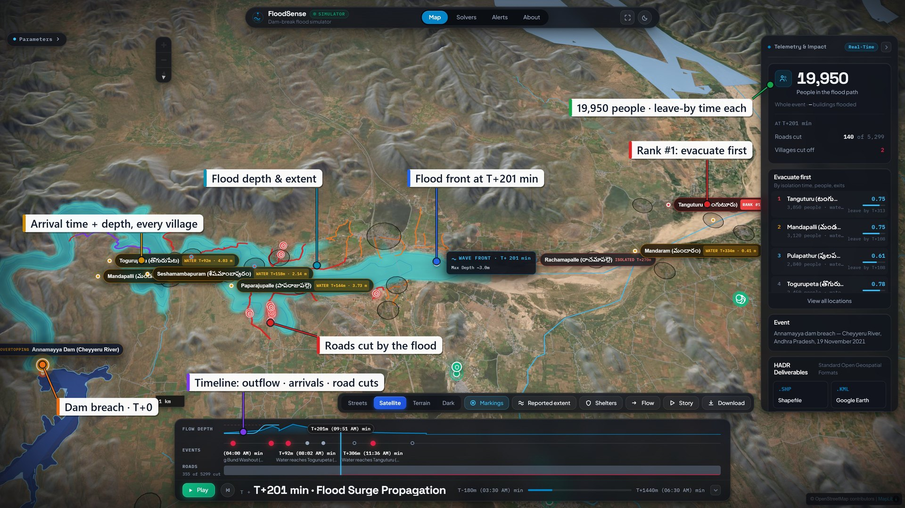
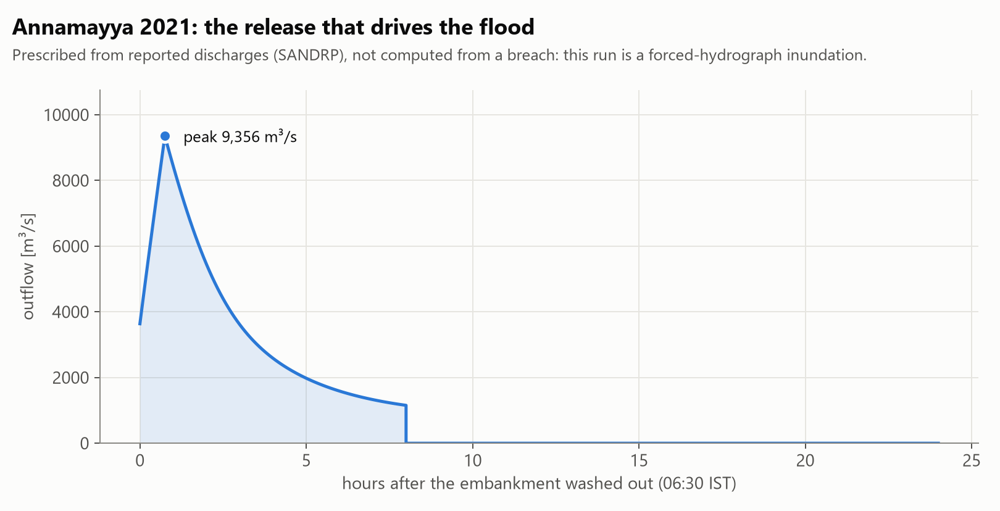
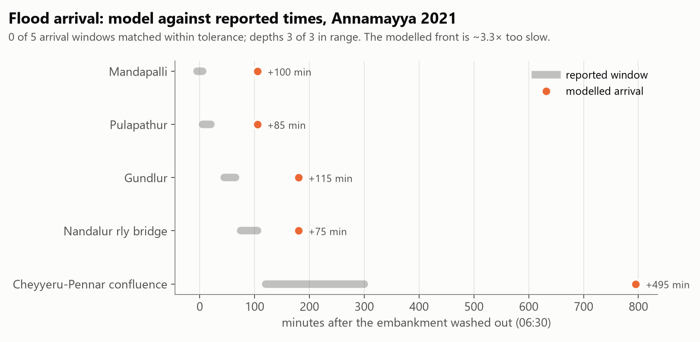
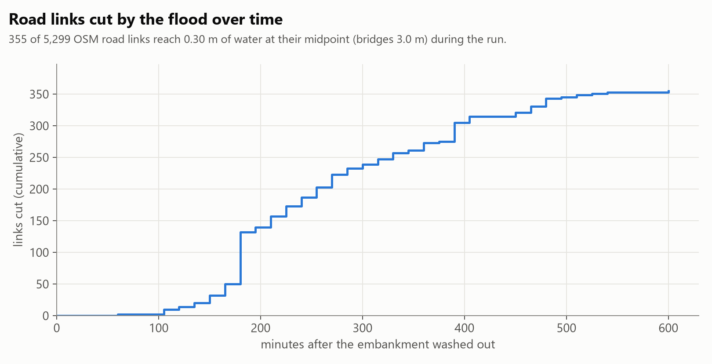
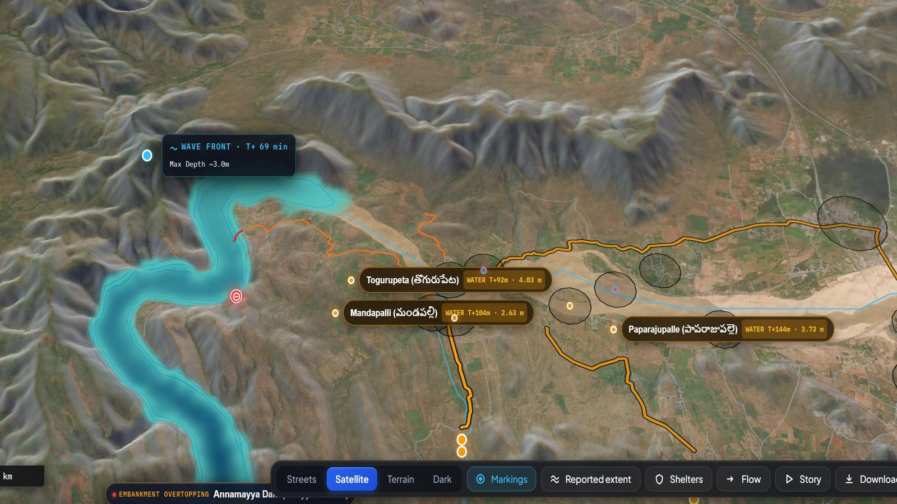
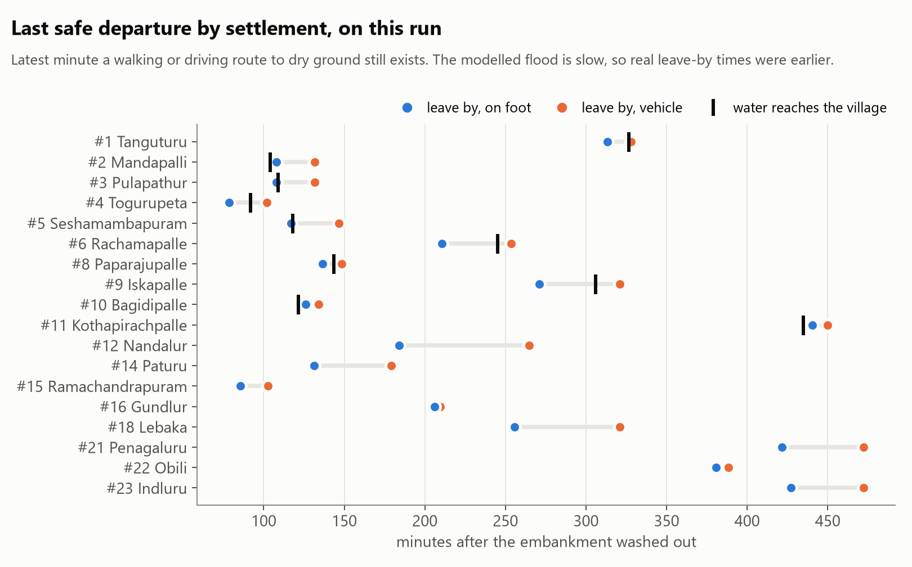
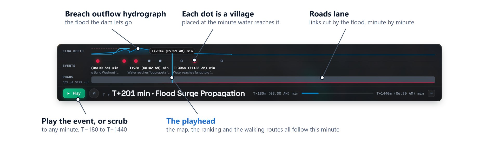
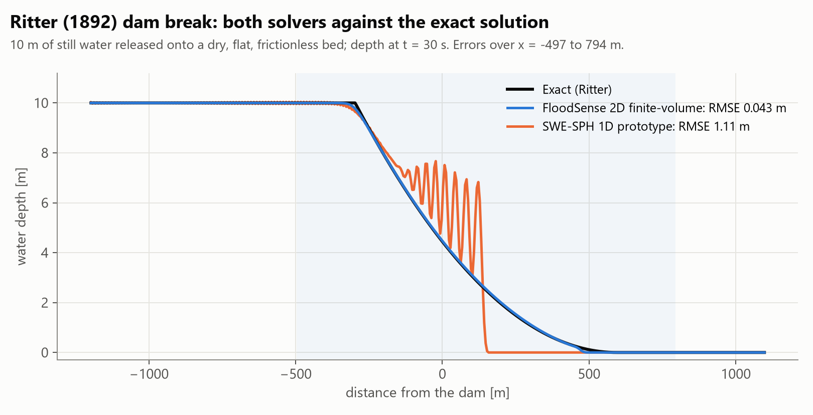
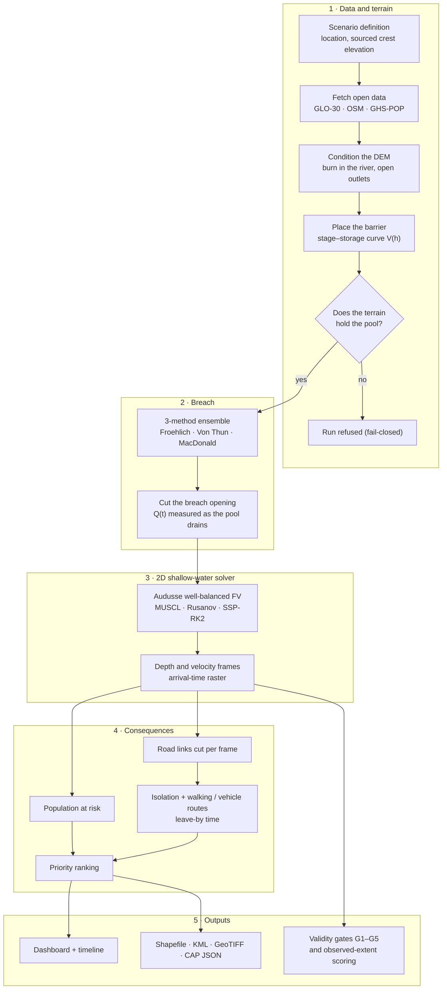

# FloodSense — SIH26161

> **India registers 6,628 specified dams, and only about 11% of the operational ones have an Emergency Action Plan. Nobody has a plan for the lake that formed behind a landslide last week. FloodSense builds a first-pass one from open data: where the water goes, which roads it cuts, who must move first, and which way they can still walk out.**

[](tests/)
[](requirements.txt)
[](#)

A rapid consequence-assessment engine for dam breaks and river blockages, built for Smart India Hackathon 2026, problem statement **SIH26161** (*Dam Break Inundation Modelling*). The codebase is called `floodsight`; the team and product are **FloodSense**.

Every number in this README comes from the code, the test suite, or the files of the served Annamayya run, and each one names where it came from. Where something is partial or not built, this README says so.



---

## Status at a glance

| PS deliverable | What exists | Status |
|---|---|---|
| (i) SPH and Delft3D, compared | Our 2D finite-volume shallow-water solver (every run); a 1D SWE-SPH solver run on the Ritter dam break | 2D FV solver **live and verified** · SWE-SPH 1D **prototype** (RMSE 1.11 m vs 0.043 m for the FV solver, see below) · Delft3D **never run** · 3D SPH **not built** |
| (i) Loss and damage | Population at risk (GHS-POP); depth–damage curve in code | Population **live** · damage in ₹ **not computed** for Annamayya: OSM has no building layer there |
| (ii) Custom framework, any dataset | New site = one JSON definition + `scripts/new_dam.py`; open data fetched per scenario; optional custom DEM, land-cover and population inputs | **Live** |
| (iii) Dashboard, .shp / .kml | MapLibre dashboard with a timeline; Shapefile, KML, GeoTIFF, CAP-structured JSON alert | **Live** |
| (iv) Near-real-time via Google Earth Engine | `src/gee_satellite.py`: Sentinel-1 SAR and Sentinel-2 NDWI, with tests | **Built, not wired**: nothing in the pipeline calls it, and no Earth Engine account is configured |
| (v) An Indian river and dam | Annamayya 2021 (Cheyyeru, Andhra Pradesh): complete 2D run driven by reported discharges | **Live**, as a forced-hydrograph inundation (details below) |

**Verification (run 2026-09-24 unless noted):**
- **300 / 300** automated tests pass (Python 3.12.7, 278 s).
- The Ritter dam-break test gives an RMSE of **0.043 m** (re-run for this README).
- Lake at rest holds with velocity **1.8 × 10⁻¹⁴ m/s** (measured 2026-09-13, pinned by `tests/test_well_balanced.py`).
- The served Annamayya run has a mass-balance error of **7.7 × 10⁻⁷**.

---

## What FloodSense does

National programmes cover **registered** dams. FloodSense is aimed at what they don't: landslide dams, moraine-dammed glacial lakes, blocked river reaches, and cascades where an unmonitored structure upstream overwhelms a dam downstream.

Given a location and a few sourced facts about the barrier (its crest elevation and the water behind it), FloodSense:

1. **Builds the terrain and the pool.** It fetches Copernicus GLO-30 elevation data, OpenStreetMap rivers and roads, and GHS-POP population. It places the barrier and checks that the terrain can actually hold the water. If it can't, the run is refused.
2. **Models the release.** A three-method breach ensemble (Froehlich 2008, Von Thun & Gillette 1990, MacDonald & Langridge-Monopolis 1984). A breach opening is cut in the barrier, and the outflow Q(t) is measured as the pool drains through it.
3. **Routes the flood** with an in-house 2D shallow-water solver: well-balanced, second order, finite volume.
4. **Works out the consequences:**
   - which road links are under water, minute by minute
   - which villages lose their last road out
   - a **walking route out of each village**, re-planned as roads flood, with the **last minute people can still leave**
   - a ranked evacuation list
5. **Exports** Shapefile, KML, GeoTIFF and a CAP-structured alert, each carrying a provenance block.

Every metric carries one of five provenance labels (`COMPUTED_LIVE`, `PRECOMPUTED`, `PROXY_DATA`, `SYNTHETIC_TERRAIN`, `NOT_AVAILABLE`, see `src/provenance.py`). A value that could not be computed is shown as `—`, never as `0`.

---

## Results: Annamayya dam, 19 November 2021

**The event.** Heavy rain filled the Annamayya reservoir on the Cheyyeru river. The Pincha ring bund upstream failed at about 03:30 IST. Annamayya began overtopping around 05:30–06:00, and its earthen embankment washed out at **06:30 IST** (MHA; range 06:15–06:30), eroding 336 m of embankment (AP Irrigation DPR, 30 Oct 2022). Forty-four people were killed, and 2.31 lakh people across 211 villages were affected (SANDRP, 5 Dec 2021). The sourced timeline is in `data/evidence/annamayya_event_evidence.json`.

**What this run is.** The dam is not in the elevation data: GLO-30 is a surface model captured with the reservoir full. So the breach cannot be simulated from the dam's geometry. This run **prescribes the release from reported discharges**, and the 2D solver computes where that water goes. It is labelled a *forced-hydrograph inundation* in its own manifest (`impoundment_modelled: false`). It is **not** a simulated dam break.

| Result (served run `annamayya_compound`) | Value | Source |
|---|---|---|
| People in the flood path | **19,950** in 10 of 23 scored settlements | `manifest.json` · GHS-POP |
| Area flooded above 0.3 m | 156.1 km², of which 56.4 km² lies on Somasila reservoir's existing water surface, so **99.6 km² of land** | `manifest.json`; Somasila share measured 2026-09-24 |
| Deepest water | 12.4 m | `manifest.json` |
| Road links cut | **355 of 5,299** OSM links, the first at T+60 min | `roads_timeline.geojson` |
| Peak prescribed release | 9,356 m³/s at T+45 min | `hydrograph.json` |
| Mass-balance error | 7.7 × 10⁻⁷ | `manifest.json` validity block |

The run's files (`manifest.json`, `hydrograph.json`, `roads_timeline.geojson`, `evac_routes.geojson`, `validation_arrivals.json`) live in `data/scenarios/annamayya_compound/` and are not committed because of their size. The figures below are generated from them by `scripts/make_readme_figures.py`.



### How close is it to what happened?

**Depths agree; arrival times do not.** Five settlements have a reported arrival time:
- **Depths:** all 3 reported depths fall inside their reported ranges.
- **Arrivals:** the model is **late at all 5, by 75 to 495 minutes.**

The modelled flood front moves about 3.3× too slowly. Four structural fixes were measured: river-channel conditioning, open outlets, channel roughness and a finer grid. Together they close 33 % of the gap. The limit is the flow speed a Manning channel can reach on this reach's own slope (108.6 m of drop over 69.8 km), so no roughness or resolution setting can match the reported times. No satellite saw this flood either: Sentinel-1 had no pass over the reach between 16 and 28 Nov, and Sentinel-2 passed into 98.7 % cloud. So there is no observed flood extent to score against.



### Roads and evacuation



For every settlement, and for every departure time, FloodSense computes the fastest route to the **dry mainland**. That is the largest connected set of roads this run never floods; the nearest dry road is often an island the flood cuts off. The route is computed for two modes: **on foot** (4.5 km/h, the primary figure, since most people evacuate without a vehicle) and **by vehicle**. The nearest dry hospital or school on the mainland is named as the onward stop.

A road link can be used only if the evacuee is **off it before it floods**. Links are checked every 25 m along their length. When a route floods, the next departure gets a new route. The last departure that still reaches dry ground is the settlement's **leave-by time** (`src/m6_isolation/evacuation.py`).





On this run, 18 settlements have a leave-by time and 5 already sit on the dry mainland. There are 73 route variants in all. For example, **Tanguturu (rank #1) must leave on foot by T+313 min**: 2.1 km, 28 min, while water reaches it at T+326.

What to keep in mind when reading these times:
- **Real leave-by times were earlier than these.** The modelled flood is 3.3× too slow, so this run shows how the method works; it is not a record of how much time people actually had.
- **Speeds are defaults, not measurements.** OSM carries no speed data here, so walkers use 4.5 km/h and vehicles use a default for each road class. The network is OSM's drive network, with no footpaths. Debris and partial blockage are not modelled.
- **Arrival and departure are measured at slightly different points.** For a few settlements (Mandapalli, Bagidipalle, Kothapirachpalle), leave-by falls a few minutes *after* water reaches the settlement point. The route starts from the nearest road node, up to 750 m away, which stays dry slightly longer.
- **An independent check passed.** Every walking route was re-walked at 4.5 km/h against the raw depth frames: **0 of 20,390 sampled points** are under 0.3 m of water on an ordinary road. The only wet points are on OSM bridge links, which assume a 3 m deck clearance.



---

## Solver verification



| Benchmark | Measured | Test threshold | Source |
|---|---|---|---|
| Ritter dam break, 2D finite-volume solver: depth RMSE (10 m, t = 30 s) | **0.043 m** | 0.60 m | `run_ritter_benchmark()`, re-run 2026-09-24 |
| Ritter, front position | lags the exact front by **10.4 %** (numerical diffusion), so arrival times read late | recorded, not gated | same run |
| Ritter, SWE-SPH 1D prototype, same window | **1.11 m** RMSE; oscillates behind the front (200 particles) | none | `ritter_dam_break_sph()`, re-run 2026-09-24 |
| Lake at rest over real conditioned terrain | velocity **1.8 × 10⁻¹⁴ m/s**, free-surface spread 2.8 × 10⁻¹⁴ m | machine precision | `tests/test_well_balanced.py` (measured 2026-09-13) |
| Active-window optimisation | bit-for-bit identical (`==`) to the full-domain solve | exact | `tests/test_swe_active_window.py` |
| 0-D reservoir integrator (`cascade.py`), Annamayya config | mass error 1.44 × 10⁻¹⁶ | machine precision | recorded 2026-09 |
| Served Annamayya 2D run | mass error 7.7 × 10⁻⁷ | validity gate | `manifest.json` |
| Evacuation routes against raw depth frames | 0 of 20,390 points wet on ordinary road | exact | independent re-walk, 2026-09-24 |

Figures are regenerated from data with `python scripts/make_readme_figures.py`.

---

## Architecture



The Annamayya run takes a different route through steps 1–2. Because the dam is missing from the DEM, `scripts/route_annamayya.py` routes the reported release into the 2D solver as a prescribed inflow. Steps 3–5 are the same.

---

## Modules

| Module | Files | What it does |
|---|---|---|
| M1 Data | `src/data_fetcher.py` | Copernicus GLO-30 tiles from the public AWS bucket, reprojected to UTM. OSM drive network, rivers, `place` settlements, and hospitals / clinics / schools. GHS-POP 100 m population. |
| M2 Geometry | `src/m2_geometry/` | DEM conditioning (`condition_dem`, `condition_flowline`, `open_river_outlets`), stage–storage fill, and the fail-closed geometry gate (`validate_geometry`, which raises `ImpoundmentDoesNotHoldError`). |
| M3 Breach | `src/m3_breach/` | Froehlich (central arm), plus Von Thun & Gillette and MacDonald & Langridge-Monopolis. The highest and lowest peak discharge become the pessimistic and optimistic arms. One shared broad-crested kernel: `Q = 1.7·B·H^1.5 + 1.35·Z·H^2.5` (`breach_kernel.py`). There is a 14-member `FailureMechanism` enum, but only overtopping and progressive breach are implemented; the others raise `NotImplementedError`. `cascade.py` holds Muskingum reach routing (`S = K[xI + (1−x)Q]`) and level-pool reservoir continuity; no currently valid scenario uses the cascade path. |
| M4 Solvers | `src/m4_solvers/` | `swe_2d.py`: Audusse hydrostatic reconstruction, MUSCL with a minmod limiter, Rusanov flux, SSP-RK2, semi-implicit Manning friction, Kurganov-Petrova desingularisation, and an active window with a 6-cell halo. `sph_swe.py`: 1D SWE-SPH (Monaghan cubic spline). `ritter.py`: the exact solution. `swe_2d_gpu.py`: an optional CuPy port, slower than the CPU on a GTX 1650. |
| M5 Exposure | `src/m5_exposure/exposure.py` | Population at risk from GHS-POP over each flooded settlement. Building, facility and ₹-loss counts run only where an OSM building layer exists; the depth–damage curve is a simplified one following the JRC shape (0.5 m → 15 %, 1 m → 35 %, 2 m → 55 %, 3 m → 75 %, 5 m → 100 %). |
| M6 Roads and evacuation | `src/m6_isolation/` | `edge_cut_times`: when each road link floods (0.30 m, bridges 3.0 m). `compute_isolation_times`: when a village loses its last road to dry ground. `evacuation.py`: time-aware routes on foot and by vehicle, and leave-by times. A 0.50 m truck threshold is defined but not used. |
| M7 Ranking | `src/m7_ranking/ranker.py` | `score = 0.35·isolation + 0.35·population + 0.15·egress + 0.15·facilities`, each banded (for example, isolation under 30 min scores 1.0, under 60 min 0.8, under 120 min 0.5). |
| M8 Exports | `src/m8_outputs/exporters.py` | Shapefile (plus `<layer>_fields.json` recording names truncated to 10 characters), KML, a CAP-structured JSON alert, and LZW-compressed float32 GeoTIFFs of peak depth and arrival time. |
| M9 Dashboard | `frontend/` | MapLibre GL map, a timeline with flow-depth, events and roads lanes, a ranked list with leave-by times, walking-route layer and exports. Served by the same FastAPI app; no build step. |
| M10 Validation | `src/m10_validation/` | CSI, POD, FAR and bias against an observed extent; arrival-time and road-damage comparisons. Needs an observation, and Annamayya has none (see above). |
| Gates | `run_pipeline.py`, `src/run_manifest.py` | G1: the water's volume matches its source. G2: no water is manufactured. G3: the flood has an outlet it can reach. G4: the terrain holds the pool. G5: the breach actually releases water. A run that fails any of them is not served. |

---

## Scenarios

`run_pipeline.py --scenario` accepts four keys. Their status is taken from `docs/PS_DELIVERABLE_SCOPE.md` and the run manifests:

| Key | Event | Barrier (config) | Status |
|---|---|---|---|
| `annamayya` | Annamayya dam, Cheyyeru, Andhra Pradesh, Nov 2021 | 26 m · 63.43 MCM | **Complete run**, as a forced-hydrograph inundation (above) |
| `phutkal` | Phutkal landslide dam, Zanskar, Ladakh (formed 31 Dec 2014, breached 7 May 2015) | 69 m · 30 MCM | Runs end to end but **fails gate G4**: the configured pool spills out of its own basin in this DEM |
| `rishiganga` | Rishi Ganga / Chamoli, Uttarakhand, Feb 2021 | 70 m · 15 MCM | **Refused**: a debris flow (the clear-water solver refuses by design), and it also fails G4 |
| `south_lhonak` | South Lhonak GLOF, Sikkim, Oct 2023 | 60 m · 50 MCM | **Refused**: no sourced crest elevation; the downstream Chungthang datum is unreconciled |

Derna 2023, Malpasset 1959 and Ivanovo 2012 have observation data used by the validation module, but no runnable scenario. Of the six events the problem statement names, **four have no scenario**: Kosi 2008, Kashmir 2014, Assam 2014, and "Wapriyang" (the Warriyang / Wapra Bung debris flow in the Kameng basin, Arunachal Pradesh, 2021).

A new dam is data, not code: a JSON file in `data/scenarios_def/` plus `python scripts/new_dam.py`. It must carry a **sourced crest elevation**. The pipeline will not invent one, and it refuses a manually supplied water level (`--wse`).

---

## Quick start

```bash
git clone https://github.com/YayaBud/floodsight.git
cd floodsight
python -m venv venv
venv\Scripts\activate            # Linux / macOS: source venv/bin/activate
pip install -r requirements.txt
pip install pytest
```

**Dashboard with the served Annamayya run:**

```bash
python -m uvicorn src.api.main:app --port 8000
```

Open http://127.0.0.1:8000, choose **Annamayya** in *Which impoundment*, and press **Play**. Saved runs that pass validity are reloaded when the server starts.

**Tests:**

```bash
python -m pytest -q
```

**A pipeline run from the command line:**

```bash
python run_pipeline.py --scenario phutkal --coarsen 4
```

This runs end to end and then reports `valid: false`, for the G4 reason given above.

| Option | Default | Notes |
|---|---|---|
| `--scenario` | `phutkal` | `phutkal`, `rishiganga`, `south_lhonak`, `annamayya` |
| `--failure-mode` | `overtopping` | `piping` is accepted by the parser but refused: not implemented |
| `--reservoir-fill` | `0.9` | fraction of the pool's volume |
| `--coarsen` | `1` | DEM downsampling factor |
| `--duration` | scenario default | simulated seconds |
| `--custom-dem` | — | your own DEM GeoTIFF (drone or LiDAR) |
| `--lulc-path` | — | a land-cover GeoTIFF, e.g. ESA WorldCover. Without one, roughness comes from height above the river plus a population-based urban value |
| `--population-csv` | — | surveyed population by settlement |
| `--dam-type`, `--crest-length` | — | embankment details |
| `--offline-demo` | off | synthetic terrain; every output is tagged `SYNTHETIC_TERRAIN` |
| `--wse` | — | **refused**: the water level comes from the sourced crest and fill, not from a flag |

---

## API

Base URL `http://127.0.0.1:8000`. Selected endpoints (`src/api/main.py`):

| Method | Endpoint | Returns |
|---|---|---|
| `POST` | `/api/run` | starts a run, returns `job_id` |
| `GET` | `/api/status/{job_id}` | progress |
| `GET` | `/api/scenarios/{key}/latest_job` | newest valid run for a scenario |
| `GET` | `/api/results/{job_id}` | settlements with exposure, isolation and ranking (GeoJSON) |
| `GET` | `/api/hydrograph/{job_id}` | outflow Q(t) |
| `GET` | `/api/roads/{job_id}` | road links with their cut times |
| `GET` | `/api/run_layer/{job_id}/evac_routes` | walking and vehicle routes with departure windows and leave-by times |
| `GET` | `/api/arrival/{job_id}` | arrival-time GeoTIFF |
| `GET` | `/api/export/{job_id}/{fmt}` | `shp`, `kml`, `cap`, `tif`, `inundation_shp`, `inundation_kml` |
| `GET` | `/api/validation/{job_id}` | skill scores, where an observation exists |

---

## Repository layout

```
floodsight/
├── run_pipeline.py          # the production pipeline
├── INVARIANTS.md            # what other code depends on, and what looks like a bug but is not
├── ATLAS.md                 # generated module and symbol map
├── src/
│   ├── data_fetcher.py      # scenarios and open-data fetchers
│   ├── provenance.py        # the five provenance labels
│   ├── run_manifest.py      # run manifests, artifact hashes, validity
│   ├── gee_satellite.py     # Earth Engine Sentinel-1 / Sentinel-2 module (not wired)
│   ├── api/                 # FastAPI app and background worker
│   ├── m2_geometry/  m3_breach/  m4_solvers/  m5_exposure/
│   ├── m6_isolation/        # isolation.py (road cuts), evacuation.py (routes, leave-by)
│   ├── m7_ranking/  m8_outputs/  m10_validation/
├── frontend/                # dashboard: index.html, map.js, spine.js, ui.js, styles.css
├── scripts/                 # route_annamayya.py, backfill_visual_layers.py, new_dam.py, make_readme_figures.py …
├── tests/                   # 300 tests
├── docs/                    # PS_DELIVERABLE_SCOPE.md, figures/, audits
└── data/                    # scenarios, DEMs, roads, population, observations
```

**Dependencies** (`requirements.txt`): numpy, scipy, rasterio, shapely, geopandas, pyproj, fiona, pysheds, osmnx, networkx, fastapi, uvicorn, pydantic, simplekml, pandas, requests, click, tqdm. The 2D solver uses Numba where available. The frontend vendors MapLibre GL JS and Plotly. The file also lists reportlab, xarray, zarr, pyarrow and lxml, which no module currently imports. Tests need `pytest`, which is not in `requirements.txt`.

---

## Known limitations

- **No scenario produces a valid dam-break run.** Only the Annamayya forced-hydrograph run is valid and served. This is the validity gates working, not a regression: they stopped being tautologies on 2026-09-12.
- **The flood front is ~3.3× too slow** (see *How close is it*), so arrival and leave-by times are late.
- **The SPH arm is a prototype, and Delft3D was never run.** There is no three-way solver comparison yet.
- **No debris or sediment physics.** Debris-flow events are refused rather than modelled as clear water.
- **Loss in ₹ and building counts** need an OSM building layer; Annamayya has none.
- **Roughness comes from terrain and population bands** unless you supply a land-cover raster. No run so far has used one.
- **The road-cut counts use each link's midpoint**, which under-reads long links. The evacuation routing samples every 25 m.
- **The evacuation network is OSM's drive network.** Walkers are not given footpaths, and debris on roads is not modelled.
- **Speeds are default values** (walking 4.5 km/h; vehicle by road class). OSM carries no speed data for these roads.
- **GLO-30 is a surface model.** It shows reservoirs as flat water planes and misses structures narrower than a cell. At Annamayya this is why the dam itself is missing and why 56 km² of "flooded area" is Somasila's existing water.
- **Google Earth Engine is not wired in**, and there are no Earth Engine credentials.

The full list, with every measurement and the approaches that were tried and rejected, is kept in `INVARIANTS.md` and `docs/PS_DELIVERABLE_SCOPE.md`.

---

## Data and attribution

| Data | Use | Licence |
|---|---|---|
| Copernicus DEM GLO-30 (ESA) | terrain | Copernicus DEM licence |
| OpenStreetMap contributors | roads, rivers, settlements, facilities | ODbL |
| GHS-POP (EC JRC) | population | CC BY 4.0 |
| ESA WorldCover (optional input) | land cover → roughness, when supplied | CC BY 4.0 |
| Copernicus EMS EMSR696 (Derna 2023) | observed extent for the validation module | © European Union |
| Global Flood Database (Tellman et al., 2021, *Nature* 596) | historical extents | CC BY-NC 4.0 |
| SANDRP, 5 Dec 2021 | Annamayya event facts and discharges | cited |

No software licence file has been added to this repository yet.

*FloodSense · SIH26161 · Theme: Disaster Management*
