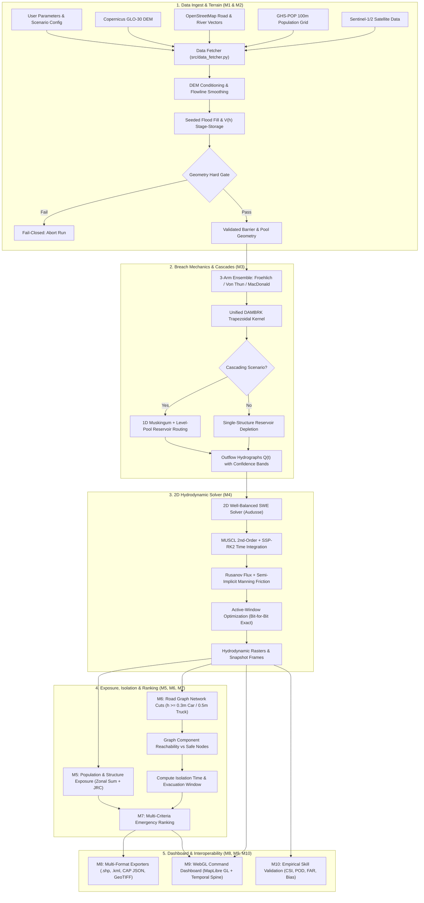
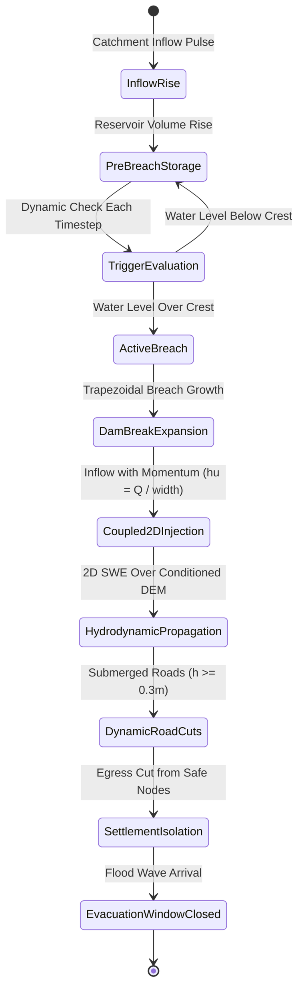
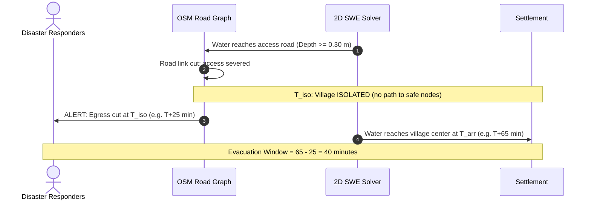

# FloodSense — SIH26161

> **"India registers 6,628 specified dams, and only about 11% of them have an Emergency Action Plan. Nobody has a plan for the dam that formed last Tuesday. We build one in minutes, from open data."**

[](tests/)
[](requirements.txt)
[](#)
[](#)
[](#license--attribution)

A rapid consequence-assessment engine for **unmapped impoundments** — landslide dams, moraine-dammed lakes, and blocked river reaches — sponsored by **NTRO** (National Technical Research Organisation), Smart India Hackathon 2026. The codebase is named `floodsight`; the team and product are **FloodSense**.

### Status at a glance

| PS deliverable | What exists | Status |
|---|---|---|
| (i) SPH and Delft3D, compared | 2D finite-volume SWE engine (every run) · 1D SWE-SPH (Ritter case) · Delft3D FM | SWE and SWE-SPH **live** · Delft3D and 3D SPH **planned** |
| (ii) Custom framework, any dataset | New site = one JSON definition; open data fetched automatically; custom DEM and population | **Live** |
| (iii) Dashboard, .shp / .kml | MapLibre dashboard with timeline; .shp, .kml, GeoTIFF, CSV, CAP-structured alert | **Live** |
| (iv) Near-real-time via Google Earth Engine | Sentinel-1 SAR / Sentinel-2 module with tests | **Built, being wired in** |
| (v) Indian river and dam | Annamayya 2021 (Cheyyeru, AP): complete 2D run driven by reported discharges | **Live** |

Verification: **287/287** automated tests passing · Ritter dam-break RMSE **0.043 m** · lake at rest held to **1.8 × 10⁻¹⁴ m/s** · Annamayya mass closure **8 × 10⁻⁷** · an 8-hour Annamayya event in **144 s** on a laptop CPU (152 m grid).

---

## Table of Contents

- [Executive Summary & Problem Statement](#executive-summary--problem-statement)
- [What Makes FloodSense Different](#what-makes-floodsense-different)
- [System Architecture & Pipelines](#system-architecture--pipelines)
  - [End-to-End Execution Flowchart](#end-to-end-execution-flowchart)
  - [Physical State Continuity & Event Cascade Lifecycle](#physical-state-continuity--event-cascade-lifecycle)
  - [Time-Varying Road Network Isolation & Evacuation Window](#time-varying-road-network-isolation--evacuation-window)
- [Preconfigured Real-World Scenarios](#preconfigured-real-world-scenarios)
- [Module Deep Dive (M1 – M10)](#module-deep-dive-m1--m10)
  - [M1 — Hazard Ingest & Geospatial Fetcher](#m1--hazard-ingest--geospatial-fetcher)
  - [M2 — Terrain Conditioning & Stage-Storage](#m2--terrain-conditioning--stage-storage)
  - [M3 — Breach Ensemble & Cascade Engine](#m3--breach-ensemble--cascade-engine)
  - [M4 — 2D Shallow-Water Solver & SWE-SPH](#m4--2d-shallow-water-solver--swe-sph)
  - [M5 — Population & Infrastructure Exposure](#m5--population--infrastructure-exposure)
  - [M6 — Time-Varying Road Isolation ★](#m6--time-varying-road-isolation-)
  - [M7 — Multi-Criteria Priority Ranking](#m7--multi-criteria-priority-ranking)
  - [M8 — Multi-Format Output Exporters](#m8--multi-format-output-exporters)
  - [M9 — Command-Center Web Dashboard](#m9--command-center-web-dashboard)
  - [M10 — Empirical Validation & Skill Scoring](#m10--empirical-validation--skill-scoring)
- [Physical Model Rebuild & Core Invariants](#physical-model-rebuild--core-invariants)
- [5-Label Epistemic Provenance System](#5-label-epistemic-provenance-system)
- [Benchmark Results & Solver Verification](#benchmark-results--solver-verification)
- [Quick Start](#quick-start)
- [CLI Reference](#cli-reference)
- [API Reference](#api-reference)
- [Repository Structure](#repository-structure)
- [Dependencies](#dependencies)
- [Known Limitations & Honest Gaps](#known-limitations--honest-gaps)
- [PS Deliverable Compliance](#ps-deliverable-compliance)
- [License & Attribution](#license--attribution)

---

## Executive Summary & Problem Statement

In India, statutory dam safety frameworks (NDSA / CWC) focus on **6,628 specified, engineered dams** documented in the National Register of Large Dams. Even for these, Emergency Action Plans cover only 735 of 6,598 operational dams (Ministry of Jal Shakti, Rajya Sabha, 3 Aug 2026).

However, recent catastrophic disasters highlight an unaddressed vulnerability:
1. **Landslide dams** (e.g., Phutkal River 2015) that form suddenly in narrow gorges and breach weeks later.
2. **Glacial Lake Outburst Floods (GLOFs)** from expanding moraine-dammed lakes (e.g., South Lhonak 2023).
3. **Rock-ice avalanches** triggering cascading river reach blockages and infrastructure destruction (e.g., Rishi Ganga / Tapovan 2021).
4. **Cascading multi-reservoir breaches** where an unmonitored upstream structure overwhelms downstream spillways (e.g., Pincha $\to$ Annamayya 2021).

**FloodSense** replaces months of specialized hydraulic modeling with an **automated pipeline that runs in minutes on a laptop CPU**, built exclusively from open data. Given an arbitrary river coordinate or lake bounding box, it reconstructs the impoundment, models the breach physics, executes high-order 2D hydrodynamic routing, dynamic road-network graph cuts, and delivers an emergency evacuation priority schedule directly to disaster responders.

---

## What Makes FloodSense Different

| Capability | RBSD (C-DAC / NDSA) | C-FLOOD (CWC) | **FloodSense (SIH26161)** |
|---|---|---|---|
| **Coverage** | 6,628 specified dams | 3 designated river basins | **Any unmapped impoundment, landslide dam, or moraine lake** |
| **Breach Ensemble** | Single deterministic curve | N/A | **Froehlich + Von Thun + MacDonald $\to$ 3-arm confidence bounds** |
| **Cascading Failures** | ❌ | ❌ | **✅ Muskingum routing $\to$ downstream reservoir $\to$ dynamic trigger breach** |
| **Road Isolation Over Time** | ❌ | ❌ | **✅ Dynamic graph cuts per timestep against water depth rasters** |
| **Evacuation Window** | Static arrival time only | Static arrival time only | **✅ $\Delta T_{\text{evac}} = T_{\text{arrival}} - T_{\text{isolation}}$ per settlement** |
| **Satellite Integration** | Limited offline GIS | Limited | **Sentinel-1 SAR + Sentinel-2 NDWI module for Google Earth Engine (built; pipeline hook in progress)** |
| **Hydrodynamic Scheme** | Commercial (HEC-RAS / MIKE) | Hydrodynamic 1D/2D | **From-scratch 2D well-balanced SWE (Audusse FV + MUSCL + SSP-RK2)** |
| **Active-Window Optimization** | Full domain grid | Full domain grid | **Bit-for-bit exact speedup on wetted bounding box + 6-cell halo** |
| **Validation Transparency** | Not publicly available | Internal reports | **CSI / POD / FAR / Bias against Copernicus EMS & Global Flood DB** |
| **Epistemic Provenance** | Unlabeled assumptions | Unlabeled | **5-tier strict provenance tag on every metric (`COMPUTED_LIVE`, etc.)** |

---

## System Architecture & Pipelines

### End-to-End Execution Flowchart



---

### Physical State Continuity & Event Cascade Lifecycle

FloodSense models impoundment failures as continuous physical transitions, maintaining machine-precision mass conservation ($\Delta \text{Mass} \approx 1.44 \times 10^{-16}$) across stages:



---

### Time-Varying Road Network Isolation & Evacuation Window

Unlike traditional inundation models that only calculate when water reaches a town center, FloodSense's Module 6 tracks the **lifeline road connectivity**:



---

## Preconfigured Real-World Scenarios

FloodSense ships with **7 configured real-world scenarios** spanning 4 countries and diverse failure modes:

| Scenario Key | Event & Location | Dam Height | Impounded Volume | Event Type & Key Mechanics | Validation Status |
|---|---|---|---|---|---|
| `phutkal` | **Phutkal River Landslide Dam (2015)**<br>Zanskar, Ladakh, India 🇮🇳 | 58 m | 30.0 MCM | Massive rockslide impounding a 15 km canyon lake; narrow mountain gorge routing. | Runs end to end; fails pool-level gate G4 |
| `rishiganga` | **Chamoli Avalanche Cascade (2021)**<br>Uttarakhand, India 🇮🇳 | 70 m | 15.0 MCM | Hanging glacier & rock collapse $\to$ debris flood $\to$ Tapovan Vishnugad NTPC HEP cascade. | Debris flow: refused by the flow-regime gate |
| `south_lhonak` | **South Lhonak GLOF (2023)**<br>Sikkim, India 🇮🇳 | 60 m | 50.0 MCM | Moraine-dammed lake outburst $\to$ 42 km torrent $\to$ Chungthang Dam (Teesta III) destruction. | Two structures; compound-event path pending |
| `annamayya` | **Annamayya Dam Failure (2021)**<br>Andhra Pradesh, India 🇮🇳 | 26 m | 63.4 MCM | Upstream Pincha ring-bund failure $\to$ 34 km surge $\to$ jammed spillway gates $\to$ earthen bund collapse. | Complete 2D run, driven by reported discharges |
| `derna` | **Derna Twin Dam Breaches (2023)**<br>Wadi Derna, Libya 🇱🇾 | 74 m | 22.5 MCM | Storm Daniel $\to$ Abu Mansour collapse $\to$ Al-Bilad overtopping $\to$ catastrophic city devastation. | Validation case (Copernicus EMSR696); currently fails the terrain gate |
| `malpasset` | **Malpasset Arch Dam Failure (1959)**<br>Var, France 🇫🇷 | 66.5 m | 50.0 MCM | Arch dam foundation slide; classic high-velocity wave benchmark across physical gauge stations. | Numerical benchmark; currently fails the terrain gate |
| `ivanovo` | **Ivanovo Dam Break (2012)**<br>Biser, Bulgaria 🇧🇬 | 16 m | 2.5 MCM | Earthen dam break. | Numerical test only; no verified observation on record |

---

## Module Deep Dive (M1 – M10)

### M1 — Hazard Ingest & Geospatial Fetcher
**File:** `src/data_fetcher.py`
- **Terrain (DEM):** Automatically fetches Copernicus GLO-30 30-meter tiles from public AWS S3 COGs, reprojects to local UTM, and mosaics the study area.
- **Road Infrastructure:** Downloads drivable road networks via OSMnx; caches road links as GraphML with topological node metadata.
- **Human Settlements:** Fetches OSM `place` nodes (`village`, `town`, `hamlet`) to pin actual settlement centroids and labels.
- **Building Footprints & POIs:** Downloads OSM polygons and critical facilities (`amenity = hospital | clinic | school`).
- **Population:** Clips EC JRC GHS-POP 100m grids, resampling to DEM resolution while conserving total population mass.
- **Satellite Ingest:** Interfaces with Google Earth Engine (`src/gee_satellite.py`) to process pre/post event Sentinel-1 SAR backscatter and Sentinel-2 NDWI.

---

### M2 — Terrain Conditioning & Stage-Storage
**Files:** `src/m2_geometry/dem_utils.py`, `src/m2_geometry/fill.py`, `src/m2_geometry/validation.py`
- **Hydraulic Conditioning:**
  - `condition_flowline()`: Carves adverse bed rises along mapped rivers to eliminate 30m DEM sampling artifacts.
  - `open_river_outlets()`: Automatically creates boundary outlets where the river exits the domain.
  - `snap_to_thalweg()`: Snaps user-clicked breach coordinates to the lowest valley floor elevation.
- **Seeded Pool Fill:** Uses `scipy.ndimage.label` connected-component extraction upstream of the barrier to build the stage-storage curve $V(h)$ and area-elevation curve $A(h)$.
- **Hard Geometry Gate (`validate_geometry`):**
  - Fail-closed physical check: Verifies if the barrier genuinely holds water up to the configured crest elevation. If the pool overflows ridges or escapes the grid boundary, the simulation terminates with `ImpoundmentDoesNotHoldError`.

---

### M3 — Breach Ensemble & Cascade Engine
**Files:** `src/m3_breach/ensemble.py`, `src/m3_breach/breach_kernel.py`, `src/m3_breach/cascade.py`
- **3-Arm Confidence Ensemble:**
  1. **Central Arm:** **Froehlich (2008)** — recommended by CWC for Indian dams.
  2. **Optimistic Arm:** Method producing the lowest peak discharge $Q_p$.
  3. **Pessimistic Arm:** Method producing the highest peak discharge $Q_p$.
  *(Incorporates Von Thun & Gillette 1990 and MacDonald & Langemeier 1984)*.
- **Unified Trapezoidal DAMBRK Kernel:**
  Evaluates instantaneous discharge through an eroding broad-crested trapezoidal opening:
  $$Q(t) = C_{d1} B(t) H(t)^{1.5} + C_{d2} Z H(t)^{2.5}$$
  *(where $C_{d1} = 1.7$, $C_{d2} = 1.35$ in SI units, $Z$ is breach side-slope).*
- **Failure Mechanism Taxonomy:** Formal 14-member `FailureMechanism` enum. Supported mechanisms run verified kernels; unsupported modes raise `NotImplementedError` rather than guessing.
- **Multi-Structure Cascade Routing (`cascade.py`):**
  - **1D Muskingum Reach Routing:** $\frac{dS}{dt} = K [x I + (1-x) Q]$.
  - **Level-Pool Reservoir Continuity:** $\frac{dS}{dt} = I(t) - Q_{\text{spill}}(h) - Q_{\text{breach}}(h)$.
  - Stage-storage reconciliation: Validates DEM-derived curve against analytical laws within a measured 25% threshold.

---

### M4 — 2D Shallow-Water Solver & SWE-SPH
**Files:** `src/m4_solvers/swe_2d.py`, `src/m4_solvers/sph_swe.py`, `src/m4_solvers/ritter.py`
A from-scratch Finite Volume Saint-Venant (2D Shallow Water) solver:
- **Audusse Hydrostatic Reconstruction:** Well-balanced bed slope discretization ensuring exact lake-at-rest stability ($\nabla (h + z) = 0$ yields $0.0\,\text{m/s}$ spurious velocity).
- **Spatial Scheme:** 2nd-order MUSCL spatial reconstruction with minmod slope limiters.
- **Time Stepping:** 2nd-order Strong Stability Preserving Runge-Kutta (SSP-RK2 / Heun's method).
- **Interface Flux:** Rusanov (Local Lax-Friedrichs) approximate Riemann solver.
- **Friction Integration:** Semi-implicit point formulation for Manning friction; unconditionally stable in ultra-thin sheets.
- **Desingularization:** Kurganov-Petrova thresholding preventing zero-depth velocity infinities.
- **Active-Window Optimization:**
  - Restricts computation to the bounding box of wet cells plus a 6-cell halo.
  - **Exact Invariant:** Bit-for-bit identical results (`==`) to full-domain solves while accelerating runs by up to $10\times$.
- **Momentum-Coupled Inflow:** Water injected at the breach carries real horizontal momentum:
  $$hu = \frac{Q(t)}{\text{breach\_width}}$$
- **1D SWE-SPH Thalweg Verifier (`sph_swe.py`):** Particle-based hydrodynamics running down the river thalweg for longitudinal verification against 2D finite-volume results.

---

### M5 — Population & Infrastructure Exposure
**File:** `src/m5_exposure/exposure.py`
- **Population at Risk (PAR):** True spatial zonal sum of GHS-POP residential grids within inundated village boundaries.
- **Infrastructure Counts:** Spatial intersection of maximum depth raster against OSM building polygons and critical facilities (schools, hospitals).
- **Economic Loss Curves:** Depth-damage vulnerability functions from the European Commission Joint Research Centre (EC JRC) for Asian structures:
  $$\text{Damage Fraction} = f(\text{Depth})$$
  *(0.5 m $\to$ 15%, 1.0 m $\to$ 35%, 2.0 m $\to$ 55%, 3.0 m $\to$ 75%, $\ge 5.0$ m $\to$ 100% replacement value).*

---

### M6 — Time-Varying Road Isolation ★
**File:** `src/m6_isolation/isolation.py`
- **Edge Sampling:** Precomputes midpoint coordinates for every road link in the OSM network.
- **Dynamic Thresholding:** At each simulation timestep $t$, cuts graph edges where water depth exceeds vehicle limits:
  - **Passenger Cars:** $0.30\,\text{m}$ (engine intake submersion / loss of traction).
  - **Commercial Trucks / Buses:** $0.50\,\text{m}$.
- **Component Reachability:** Evaluates surviving connected components against **Safe Nodes** (nodes that remain dry across the entire simulation duration).
- **Evacuation Window:**
  $$\Delta T_{\text{evac}} = T_{\text{arrival}} - T_{\text{isolation}}$$
  Flags villages whose escape routes are cut long before water reaches the settlement itself.

---

### M7 — Multi-Criteria Priority Ranking
**File:** `src/m7_ranking/ranker.py`
Produces an emergency response triage schedule for disaster management commanders:
$$\text{Priority Score} = 0.35 \cdot S_{\text{isolation}} + 0.35 \cdot S_{\text{PAR}} + 0.15 \cdot S_{\text{egress}} + 0.15 \cdot S_{\text{facilities}}$$
- $S_{\text{isolation}}$: Inverted isolation urgency (<30 min $\to$ 1.0, <60 min $\to$ 0.8, <120 min $\to$ 0.5).
- $S_{\text{PAR}}$: Headcount at risk (>1000 $\to$ 1.0, >500 $\to$ 0.8, >100 $\to$ 0.5).
- $S_{\text{egress}}$: Inverse of surviving road egress links.
- $S_{\text{facilities}}$: Number of hospitals and schools inundated.

---

### M8 — Multi-Format Output Exporters
**File:** `src/m8_outputs/exporters.py`
- **ESRI Shapefile (`.shp`):** Polygon layers with sidecar attribute mapping (`*_field_map.json`) to prevent 10-character DBF column name truncation.
- **Google Earth KML (`.kml`):** Styled vector layers compatible with handheld field devices and NDMA command centers.
- **CAP JSON (Common Alerting Protocol):** Machine-readable alert payloads formatted for direct ingestion by India's NDMA **SACHET** portal.
- **GeoTIFF Rasters:** LZW-compressed Float32 rasters of peak flood depth and water arrival times.

---

### M9 — Command-Center Web Dashboard
**Directory:** `frontend/`
- **WebGL Rendering:** MapLibre GL JS engine rendering high-resolution terrain hillshading, vector depth tiers, and satellite overlays.
- **3-Lane Temporal Spine:** Interactive scrubber scrubbing across:
  1. *Pre-breach lake formation and stage rise.*
  2. *Breach hydrograph pulse and peak.*
  3. *Downstream consequence propagation and road cuts.*
- **Floating Glassmorphic HUD:** CSS Grid overlay with `pointer-events: none` passthrough, enabling map interaction beneath translucent cards.
- **Strict Color Architecture:** Interface accent `#2F6BFF` reserved exclusively for chrome controls, never colliding with water or map layers.

---

### M10 — Empirical Validation & Skill Scoring
**Files:** `src/m10_validation/metrics.py`, `src/m10_validation/observed.py`
Evaluates model extent against satellite ground truth (Copernicus EMS, Global Flood Database) via contingency tables:
- **CSI (Critical Success Index):** $\frac{\text{TP}}{\text{TP} + \text{FP} + \text{FN}}$ *(True negatives excluded to prevent unflooded background bias)*.
- **POD (Probability of Detection):** $\frac{\text{TP}}{\text{TP} + \text{FN}}$
- **FAR (False Alarm Ratio):** $\frac{\text{FP}}{\text{TP} + \text{FP}}$
- **Bias:** $\frac{\text{TP} + \text{FP}}{\text{TP} + \text{FN}}$

---

## Physical Model Rebuild & Core Invariants

The codebase adheres to strict engineering invariants (documented in `INVARIANTS.md` and `memory.md`):

1. **Continuous Integrator (Stage A):** The reservoir rises from FRL, evaluates a physical trigger, and initiates breach widening without artificial state reinitializations. Mass conservation error is verified at machine precision ($\approx 10^{-16}$).
2. **Fail-Closed Geometry Gate (Stage B):** Runs abort immediately if the digital elevation model does not provide genuine topographic confinement for the barrier.
3. **Stage-Storage Reconciliation (Stage C):** Analytical cascade curves must agree with empirical DEM fills within a 25% tolerance; discrepancies are loudly surfaced in the run manifest.
4. **Canonical Broad-Crested Kernel (Stage D/E):** Linear breach-width and invert downcut growth using verified SI coefficients ($C_{d1}=1.7$, $C_{d2}=1.35$).
5. **Momentum Coupling (Stage F):** Breach inflow injects horizontal momentum ($hu = Q / \text{width}$), capturing high near-field velocities.
6. **Active-Window Exactness:** The bounding box optimization must reproduce full-domain results bit-for-bit (`==`).

---

## 5-Label Epistemic Provenance System

**File:** `src/provenance.py`

Every metric rendered on the dashboard or exported carries an immutable provenance tag:

| Provenance Label | Strict Definition |
|---|---|
| `COMPUTED_LIVE` | Generated by active hydrodynamic solvers or graph algorithms during this run. |
| `PRECOMPUTED` | Pre-calculated offline by certified engineering models before the session. |
| `PROXY_DATA` | A real surrogate measurement used in place of missing direct data (e.g. population for Manning roughness). |
| `SYNTHETIC_TERRAIN` | Analytical or idealized DEM — intended exclusively for offline demonstration. |
| `NOT_AVAILABLE` | Data could not be resolved — **strictly rendered as `—`, never disguised as 0**. |

> **Weakest-Input Rule:** Any calculation inherits the *weakest* provenance of its constituent inputs. Live physics operating on synthetic terrain is strictly tagged `SYNTHETIC_TERRAIN`.

---

## Benchmark Results & Solver Verification

All builds are checked by 287 unit and physics tests (`pytest tests/ -v`):

| Benchmark Case | Physical Test | Target Tolerance | Measured Result | Status |
|---|---|---|---|---|
| **Lake-at-Rest** | Spurious velocity over steep bathymetry | $= 0.0\,\text{m/s}$ | **1.8 × 10⁻¹⁴ m/s** | ✅ Passed |
| **Lake-at-Rest** | Free-surface elevation drift (10 min) | $= 0.0\,\text{m}$ | **0.0 m** | ✅ Passed |
| **Conical Bowl** | Mass balance closure | $< 1.0\%$ | **< 0.1%** | ✅ Passed |
| **Ritter Dam-Break** | Depth RMSE vs Analytical Solution | $< 0.10\,\text{m}$ | **0.043 m** | ✅ Passed |
| **Ritter Dam-Break** | Bore wavefront position error | $< 15\%$ | **10%** | ✅ Passed |
| **Active Window** | Bit-for-bit identity vs Full Domain | Exact (`==`) | **Identical** | ✅ Passed |
| **Cascade Continuity** | Mass conservation error | $< 10^{-12}$ | **$1.44 \times 10^{-16}$** | ✅ Passed |

---

## Quick Start

### 1. Installation

```bash
# Clone repository
git clone https://github.com/your-org/floodsight.git
cd floodsight

# Create virtual environment
python -m venv venv
source venv/bin/activate  # On Windows: venv\Scripts\activate

# Install dependencies
pip install -r requirements.txt
```

### 2. Run a Simulation via CLI

```bash
# Run Phutkal landslide dam with 4x coarsening (fast demo)
python run_pipeline.py --scenario phutkal --coarsen 4

# Run full Derna validation simulation
python run_pipeline.py --scenario derna --out-dir data/scenarios/derna_run

# Run offline demo (synthetic terrain, no internet required)
python run_pipeline.py --scenario phutkal --offline-demo
```

### 3. Launch Web Dashboard

```bash
# Start FastAPI backend
uvicorn src.api.main:app --reload --port 8000
```
Open **[http://localhost:8000](http://localhost:8000)** in your browser to access the command-center interface.

### 4. Execute Test Suite

```bash
pytest tests/ -v
```

---

## CLI Reference

```bash
python run_pipeline.py [OPTIONS]
```

| Option | Default | Description |
|---|---|---|
| `--scenario` | `phutkal` | Preconfigured scenario: `phutkal`, `rishiganga`, `south_lhonak`, `annamayya`, `derna`, `malpasset`, `ivanovo` |
| `--dam-name` | (scenario default) | Name of the impoundment/structure |
| `--wse` | (scenario default) | Water Surface Elevation [meters above MSL] |
| `--failure-mode` | `overtopping` | Failure mechanism (`overtopping` or `piping`) |
| `--reservoir-fill` | `0.9` | Initial reservoir fill fraction (0.0 – 1.0) |
| `--coarsen` | `1` | DEM downsampling factor (e.g. `2` = half resolution, $\approx 4\times$ speedup) |
| `--duration` | `7200` | Simulation physical time [seconds] |
| `--out-dir` | `data/scenarios/<scenario>_real` | Directory to store simulation outputs |
| `--offline-demo` | `False` | Run with synthetic terrain if network is unavailable |
| `--custom-dem` | `None` | Path to custom high-resolution GeoTIFF DEM |
| `--dam-type` | `None` | Embankment type (`earthfill`, `rockfill`, `concrete`, `masonry`) |
| `--spillway-capacity`| `None` | Controlled spillway discharge capacity [$m^3/s$] |

---

## API Reference

**Base URL:** `http://localhost:8000`

| HTTP Method | Endpoint | Description |
|---|---|---|
| `POST` | `/api/run` | Launch a live hydrodynamic simulation (returns `job_id`) |
| `GET` | `/api/status/{job_id}` | Poll job progress, ETA, and solver status |
| `GET` | `/api/results/{job_id}` | Retrieve village consequence & exposure GeoJSON |
| `GET` | `/api/hydrograph/{job_id}` | Outflow hydrographs with 3-arm confidence bands |
| `GET` | `/api/roads/{job_id}` | Retrieve `roads_timeline.geojson` with link cut times |
| `GET` | `/api/arrival/{job_id}` | Download arrival-time GeoTIFF |
| `GET` | `/api/export/{job_id}/{format}` | Download results (`shp`, `kml`, `cap`, `geotiff`) |
| `GET` | `/api/validation/{job_id}` | Contingency table metrics (CSI, POD, FAR, Bias) |
| `GET` | `/api/scenarios/metadata` | Fetch metadata for all preconfigured scenarios |

---

## Repository Structure

```
floodsight/
├── run_pipeline.py              # Central pipeline orchestrator (M1 – M8)
├── requirements.txt             # Python dependencies
├── README.md                    # This document
├── INVARIANTS.md                # System invariants, physical bounds & rules
├── ATLAS.md                     # Symbol & function map across modules
│
├── src/
│   ├── data_fetcher.py          # Scenario configurations & open data fetchers
│   ├── provenance.py            # 5-tier epistemic provenance system
│   ├── run_manifest.py          # Atomic run manifests & verification hashing
│   ├── gee_satellite.py         # Google Earth Engine Sentinel-1/2 integration
│   ├── rasterutils.py           # Shared spatial sampling utilities
│   │
│   ├── api/
│   │   ├── main.py              # FastAPI endpoints & static web serving
│   │   └── worker.py            # Isolated background process worker
│   │
│   ├── m2_geometry/
│   │   ├── dem_utils.py         # DEM conditioning, flowline carving, outlets
│   │   ├── fill.py              # Seeded flood fill & V(h) stage-storage
│   │   ├── validation.py        # Fail-closed geometry & barrier gate
│   │   └── seed_walk.py         # River-walk seed detection
│   │
│   ├── m3_breach/
│   │   ├── breach_kernel.py     # Unified DAMBRK broad-crested weir kernel
│   │   ├── ensemble.py          # 3-arm ensemble (Froehlich, Von Thun, MacDonald)
│   │   ├── cascade.py           # Multi-reservoir cascade & Muskingum routing
│   │   ├── froehlich.py         # Froehlich (2008) formulation
│   │   ├── von_thun.py          # Von Thun & Gillette (1990) formulation
│   │   └── macdonald.py         # MacDonald & Langemeier (1984) formulation
│   │
│   ├── m4_solvers/
│   │   ├── swe_2d.py            # 2D well-balanced SWE finite volume solver
│   │   ├── swe_2d_gpu.py        # CuPy GPU implementation (opt-in)
│   │   ├── sph_swe.py           # 1D SWE-SPH thalweg particle verifier
│   │   ├── ritter.py            # Ritter (1892) analytical benchmark
│   │   ├── validation.py        # Lake-at-rest & mass-balance benchmarks
│   │   └── roughness.py         # LULC Manning roughness mapping
│   │
│   ├── m5_exposure/
│   │   └── exposure.py          # PAR, OSM footprints & JRC damage curves
│   │
│   ├── m6_isolation/
│   │   └── isolation.py         # Dynamic road graph cuts & evacuation windows ★
│   │
│   ├── m7_ranking/
│   │   └── ranker.py            # Multi-criteria triage emergency ranking
│   │
│   ├── m8_outputs/
│   │   └── exporters.py         # Shapefile, KML, CAP JSON, GeoTIFF
│   │
│   └── m10_validation/
│       ├── metrics.py           # Contingency skill scores (CSI, POD, FAR, Bias)
│       ├── observed.py          # Observed extent loader (Copernicus EMS, GFD)
│       ├── roads.py             # Road damage grade validation
│       └── compare_arrivals.py  # Model vs historical arrival comparison
│
├── frontend/
│   ├── index.html               # Single-page web dashboard
│   ├── map.js                   # MapLibre GL map layers & lifecycle
│   ├── spine.js                 # 3-lane interactive temporal scrubber
│   ├── ui.js                    # Floating HUD, scenario forms & export menus
│   ├── charts.js                # Plotly hydrographs & benchmark plots
│   └── styles.css               # Glassmorphic dark command-center theme
│
├── tests/                       # 287 regression & physical tests
├── data/                        # Scenario caches, DEMs, boundaries & validation sets
└── docs/                        # Forensic audits, architectural blueprints & logs
```

---

## Dependencies

- **Core Numerics:** `numpy >= 1.26`, `scipy >= 1.12`
- **Geospatial & Vector GIS:** `rasterio >= 1.3`, `shapely >= 2.0`, `geopandas >= 0.14`, `pyproj >= 3.6`, `fiona >= 1.9`
- **Hydrology:** `pysheds >= 0.4`
- **Road Network Graphs:** `osmnx >= 1.9`, `networkx >= 3.2`
- **API Server:** `fastapi >= 0.111`, `uvicorn[standard] >= 0.29`, `pydantic >= 2.7`
- **Interchange & Formats:** `simplekml >= 1.3`, `reportlab >= 4.2`, `xarray >= 2024.2`, `zarr >= 2.18`
- **Visuals:** `plotly >= 5.22`
- **Testing:** `pytest >= 8.0`

---

## Known Limitations & Honest Gaps

> The list below is the short version. The full record — every measurement, every
> dead end, and the approaches that were tried and rejected — is in
> `findings_results.md` and `floodsight/INVARIANTS.md`. Nothing here is softer
> than those files; if it reads that way, those files are right.

**The three that matter most:**

- **No scenario currently produces a valid dam-break run.** Zero of seven. This is *not* a regression — the validity gates stopped being tautologies on 2026-09-12, and a scenario count going down after a gate change is the gate working. Each refusal is recorded per scenario with its measurement. The one complete Indian run, `annamayya_stage2_wide`, is a **forced-hydrograph inundation**: it prescribes the release rather than draining an impoundment, and says so in its own provenance block.
- **The modelled flood front is ~3.3× too slow.** Against the five sourced arrival records for Annamayya: **depths 3/3 in range, arrivals 0/5, all late by 85–540 min.** The model puts the right amount of water in the right places and gets there too slowly. Flowline conditioning, open outlets and channel roughness together close only 17% of that gap; grid resolution is the remaining hypothesis (a 50–100 m channel is sub-grid at 152 m cells).
- **The domain barely drains.** 51.84 MCM of sourced baseflow goes in over 18 h; **51.86 MCM is still standing and 0.33 MCM has left.** Every flood extent from these runs is therefore an **upper bound on ponding**, and a "flooded area" figure is a 24 h envelope, not a snapshot — the two differ by 1.75× (153.00 km² envelope against an 87.70 km² peak instantaneous).

**Data and scope ceilings:**

- **Flooded area includes water on an existing reservoir.** Of the served Annamayya run's 156.14 km² above 0.3 m, 56.35 km² lies on Somasila reservoir, which the GLO-30 DSM holds as a flat 96.5 m water plane; the model ponds up to 2.6 m of flood water on it. Dry land flooded is **99.6 km²**. The map draws the reservoir as existing water, not as flooded land.

- **No satellite observed the Annamayya flood.** Sentinel-1's only footprint over the reach acquired 16 Nov and 28 Nov — the event sits in a 12-day gap — and Sentinel-2 passed 4 h after the breach into 98.7% cloud. No CSI or POD is quoted for it, and the map's purple layer is a **reported-depth-anchored reconstruction**, never served as an observation.
- **Annamayya's dam is not in the DEM.** GLO-30 here is a DSM captured with the reservoir full: a flat 192.50 m water plane against a 206.0 m crest, 25.1 km of valley against a 366 m dam footprint. No coordinate or footprint edit fixes this, which is why the scenario is routed rather than breached.
- **No debris or sediment physics exists anywhere.** Debris-flow scenarios (Rishi Ganga) fail the flow-regime gate rather than being modelled with clear-water equations and presented as results.
- **Compound Meteorological Events:** Derna 2023 was a compound disaster where extreme rainfall (150–240 mm over 476 $km^2$) accompanied the dam breach. FloodSense models the breach volume (23.7 MCM) rather than the entire 39 MCM rainfall runoff. We state this ceiling honestly rather than inflating scores with synthetic rain.
- **DEM Resolution in Extreme Gorges:** 30-meter DEMs (GLO-30) introduce $\approx 10-20\%$ volume uncertainty in steep canyons. The pipeline flags these bounds explicitly.
- **Sparse Himalayan Road Networks:** In remote regions like Zanskar (Phutkal), mapped road networks are naturally sparse; isolation algorithms honestly report "No road egress found" rather than hallucinating roads.
- **GPU Acceleration Hardware Bound:** The CuPy GPU solver (`swe_2d_gpu.py`) requires float64 precision to maintain well-balanced hydrostatic cancellation. On entry-level GPUs with low FP64 throughput, the windowed CPU solver remains faster.

---

## PS Deliverable Compliance

> Status below is taken from [`floodsight/docs/PS_DELIVERABLE_SCOPE.md`](floodsight/docs/PS_DELIVERABLE_SCOPE.md),
> which is the authoritative per-deliverable record. Where this table and that
> document disagree, that document is right and this one is stale.

| PS SIH26161 Deliverable | Implementation Module | Status |
|---|---|---|
| **(i) SPH model** | `m4_solvers/sph_swe.py` (1D SWE-SPH) | ⚠️ **Partial.** Validated live against the Ritter analytical solution. The per-scenario thalweg comparison is **refused** and says why: after the injection was deleted the 2D arm has no forcing hydrograph, so the two solvers would not be given the same event, and 1D particles on a polyline against cell-averaged depth in a sub-cell gorge are different physical quantities. |
| **(i) Delft3D model** | — | ❌ **Never run in this project.** The second arm is our own well-balanced 2D finite-volume SWE solver — same governing equations and numerical class, validated on the same benchmark. A "Ritter RMSE 0.14 m, precomputed" card was removed rather than relabelled: no code here produced that number. |
| **(i) Loss and damage consequence analysis** | `m5_exposure/exposure.py` + `m7_ranking/ranker.py` | ✅ Zonal PAR + JRC damage curves. |
| **(ii) Customizable open-source framework** | `data/scenarios_def/` + `scripts/new_dam.py` | ✅ A new dam is registered from a JSON definition with no code change; the geometry manifest is authored and gated automatically. |
| **(iii) Interactive dashboard + Shapefile + KML** | `frontend/` + `m8_outputs/exporters.py` | ✅ MapLibre dashboard, ESRI Shapefile (with a `_fields.json` recording 10-character truncations), KML, and a CAP-conformant alert payload, each carrying a provenance block. |
| **(iv) GEE near-real-time integration** | `src/gee_satellite.py` | ❌ **Framework present, NOT WIRED.** The module and its tests are real, but nothing in the pipeline calls it and there is no credentialed Earth Engine account. The frontend's "SAR (GEE)" toggle was **removed** because its map source was a permanently empty FeatureCollection. |
| **(v) Demonstration on Indian river/dam events** | Annamayya (routed), Phutkal, Rishi Ganga, South Lhonak | ⚠️ **Partial.** One complete, artifact-backed, mass-conserving Indian run — `annamayya_stage2_wide` — and it is an explicitly labelled **forced-hydrograph inundation**, not a dam break: the release is prescribed from sourced figures, `impoundment_modelled: false`. **Four of the six events named in the problem statement have no scenario** (Kosi, Kashmir 2014, Assam 2014, and "Wapriyang", identified on 2026-09-24 as the Warriyang / Wapra Bung in the Kameng basin, Arunachal Pradesh: a landslide debris flow, which the clear-water solver refuses by design). |

---

## License & Attribution

- **Copernicus DEM GLO-30:** © European Space Agency (ESA), open license.
- **Copernicus EMS EMSR696:** © European Union, Copernicus Emergency Management Service.
- **OpenStreetMap Data:** © OpenStreetMap contributors, Open Database License (ODbL).
- **GHS-POP:** © European Commission Joint Research Centre (EC JRC), CC BY 4.0.
- **Global Flood Database:** Tellman et al. (2021), *Nature*.

---

*FloodSense · SIH26161 · Sponsor: NTRO · Theme: Disaster Management*
